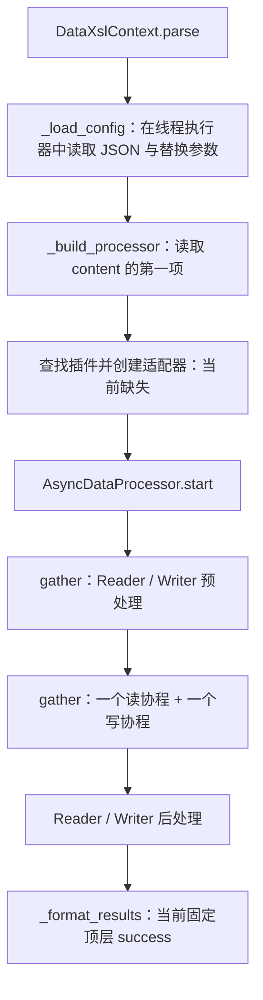
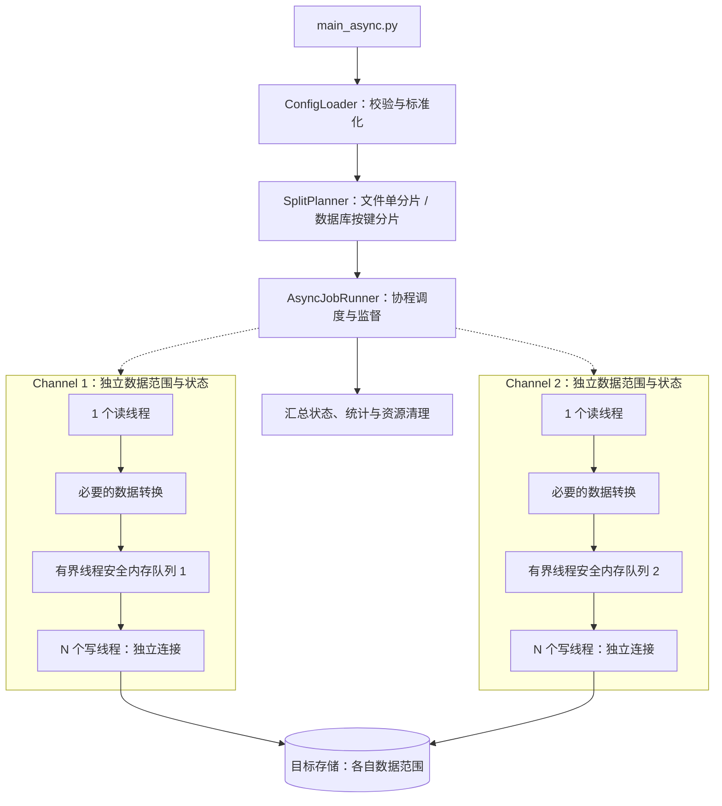

# DataXSL 异步模型架构方案

> 更新日期：2026-09-16。本文针对 `main_async.py` / `src/aiodataxsl`，根据作者确认的设计语义和当前源码整理。异步链路尚未完成；目标方案与当前草稿分别描述。
> 多进程实现见 [多进程模型架构方案](architecture-multiprocess.md)。

## 1. 定位与设计语义

DataXSL 是离线数据转换工具。异步入口的目标是由协程协调读写任务和生命周期，每个通道通过 **1 个读线程 + N 个写线程** 执行数据搬运与转换，利用读写等待时间推进其他任务。

| 参数 / 概念 | 异步模型语义 |
| --- | --- |
| `channel=C` | C 个数据隔离的通道，每通道一组逻辑 Reader / Writer 和独立队列 |
| `parallel=N` | 每通道 N 个写线程，另有固定 1 个读线程；不表示协程数 |
| `queue_size` | 每通道队列可容纳的批次数，限制在途数据量 |
| `chunk_size` | Reader 每批处理的行数 |
| 文件数据源 | 暂按一个通道处理，不做文件分片 |
| 数据库数据源 | 后续按主键或辅助键分片，各通道读取自己的数据范围 |

一组逻辑 Reader / Writer 是插件组合，Writer 可以有 N 个线程执行实例；建议各实例持有独立连接和状态。

例如 `channel=2, parallel=4` 的目标规模是 2 个读线程、8 个写线程和 2 条独立队列。事件循环与其他协调资源不计入 `parallel`。线程数量不会因使用协程而自动满足，必须由执行器明确创建和约束。

## 2. 当前源码结构与完成度

| 路径 | 当前职责及状态 |
| --- | --- |
| `main_async.py` | `asyncio.run(main())` 启动事件循环，解析 `--job`、`--param`；调用 `parse()` 时缺少 `await` |
| `src/aiodataxsl/core.py` | DataXslContext 加载配置和尝试构建适配器；AsyncDataProcessor 协调读写协程 |
| `src/aiodataxsl/reader.py` | AsyncReader 接口：`read_async(queue)`、`validate()`、`pre_deal()`、`post_deal()` |
| `src/aiodataxsl/writer.py` | AsyncWriter 接口：`write_async(queue)`、`validate()`、`pre_deal()`、`post_deal()` |
| `src/aiodataxsl/excel/excel_reader.py` | AsyncExcelReader 草稿：解密、分批读取、DataFrame 转换及异步入队 |
| `src/aiodataxsl/excel/excel_writer.py` | 空文件 |
| `src/aiodataxsl/mysql/` | Reader / Writer 文件为空，尚无异步数据库输出实现 |
| `src/aiodataxsl/register.py`、`utils.py` | 空文件 |
| `src/aiodataxsl/logging_config.py`、`error.py` | 日志配置加载及参数异常 |
| `setup.py` | 显式包列表目前只包含同步 `dataxsl` 包，异步包发布方式需补齐 |

同步包中的 ExcelReader、TextReader 和 MySQLWriter 可以作为后续复用候选，但目前缺少适配与装配链路，不能据此宣称异步版已经支持这些完整数据路径。

### 2.1 当前入口的实际行为

1. `asyncio.run(main())` 进入协程入口。
2. 解析 `--job` 与 `--param`，创建异步 DataXslContext。
3. `result = context.parse(args)` 仅创建协程对象，没有 `await`，不会进入配置解析和转换流程。
4. 打印的是协程对象，而非作业执行结果。

补上 `await` 之后仍有构建缺口，不能仅修复入口就认为链路可运行。

### 2.2 草稿内部的处理结构

以下描述的是方法内部编排，不代表入口已能完整执行：



AsyncDataProcessor 内部只有一条容量写死为 1000 的 `asyncio.Queue`；不存在按 `channel` 创建隔离通道、按 `parallel` 创建 N 个写线程的实现。

### 2.3 主要实现缺口

| 问题 | 当前影响 |
| --- | --- |
| 入口缺少 `await context.parse(args)` | 作业协程未执行 |
| Context 使用 PluginRegistry 但未导入，异步注册器为空 | 插件构建无法完成 |
| 引用的 `dataxsl.async_adapter.AsyncAdapter` 不存在 | 同步插件适配路径未实现 |
| Context 传入 `max_concurrent`，AsyncDataProcessor 构造器不接收 | 构造调用不兼容 |
| 读取 `setting.speed.channel` 并赋给 `max_concurrent` | 未形成通道语义，且与同步扁平 setting 结构不一致 |
| Writer 文件为空，无线程角色管理 | 无完整输出链路，未落实一读多写 |
| `_format_results()` 固定顶层 `success` | 子任务非零状态不能正确反映为作业失败 |
| `stop()` 只设置事件，读写循环未检查该事件 | 取消未形成有效退出协议 |
| 成功/失败后的业务后处理与资源清理未分离 | 失败时可能错误执行后处理或遗漏清理 |

AsyncExcelReader 还有一个执行位置问题：`read_sync()` 是生成器函数，在执行器中调用它只返回生成器；后续 `for df in data_generator` 位于协程中，实际读取及 DataFrame 构造仍会在事件循环线程执行。`await asyncio.sleep(0)` 只在批次之间让出执行权，不能把一批内部的阻塞工作移入读线程。

该读取器只在正常结束时发送一个 `None`；异常路径可能没有结束通知，也不满足 N 个消费者的退出需要。以上为本轮静态阅读结论，未进行异步端到端执行验证。

## 3. 目标架构（尚未实现）

采用“配置标准化 → 数据分片 → 通道调度 → 线程读写 → 结果汇总”的结构。协程管理调度和等待，线程承担阻塞读写，各通道的数据完全隔离。



图中虚线表示调度关系，实线表示处理流程。每个通道的 N 个写线程竞争消费自己的队列，每个批次交给其中一个线程；不是把同一批数据广播给所有写线程。

### 3.1 建议模块边界

| 模块 | 职责 |
| --- | --- |
| ConfigLoader / JobConfig | 加载配置、替换变量、兼容旧格式、严格校验及合并默认值，不产生目标副作用 |
| SplitPlanner / JobPlan | 生成互不重叠且完整覆盖数据范围的分片 |
| AsyncJobRunner | 调度通道、执行作业级前后处理、监督错误和取消、汇总结果 |
| AsyncChannelRunner / ChannelContext | 管理一个通道的 1 读线程、N 写线程、独立队列和结束状态 |
| PluginFactory / ThreadAdapter | 装配插件，在线程中执行阻塞方法，把执行结果交还协程 |
| Reader / Transformer | 读取、按批生成 DataFrame，完成明确的字段映射、类型转换和校验 |
| Writer | 在所属线程内管理连接与批次事务，根据目标 schema 写入 |
| JobResult | 返回作业和各通道状态、读取/写入/失败行数、耗时与错误原因 |

这些名称是建议职责划分，并非当前源码中已实现的类。初期转换可作为读线程内的独立步骤，无需增加额外转换线程。

## 4. 协程、线程与队列边界

### 4.1 建议的第一阶段实现方式

每通道使用有界的线程安全内存队列承载数据，配备一个读线程和 N 个写线程。协程异步等待线程任务结果，负责故障发现、通道协调和生命周期管理；不在事件循环中直接调用阻塞的队列或数据库操作。

线程池需要保证读写两侧都能启动。若长期等待队列的写任务占满全部线程，读任务没有执行机会，就可能死锁。可为各通道预留完整的 1+N 执行容量，或分开管理读写执行资源。

### 4.2 “非阻塞”的准确含义

目标是等待时不阻塞事件循环。有界队列满时读线程等待容量，空时写线程等待数据，其他线程和协程可以继续运行，这种反馈称为背压。队列协调速度，但不会自动增减线程数。

`queue.Queue` 提供线程同步机制；`asyncio.Queue` 面向事件循环且不是线程安全队列。若后续使用异步队列，需要明确跨线程桥接，不能从读写线程直接调用其方法。`await queue.put()` / `get()` 等待条件满足；`put_nowait()` / `get_nowait()` 无法操作时抛异常，不自动重试。参见 [线程队列文档](https://docs.python.org/3/library/queue.html) 和 [asyncio 队列文档](https://docs.python.org/3/library/asyncio-queue.html)。

### 4.3 实际执行位置

同步文件读取、数据库调用以及生成器的迭代都应发生在指定工作线程中。把“生成器创建”放入执行器，不等于把“迭代读取”放入执行器。

协程通过 `await` 等待任务完成；仅启动 N 个写协程不能满足 N 个写线程的设计。协程机制和线程适配的标准库说明见 [Python 协程与任务文档](https://docs.python.org/3/library/asyncio-task.html)。

## 5. 数据契约、生命周期与失败处理

### 5.1 数据契约

- 数据载体可继续采用 DataFrame，显式定义源字段、目标字段、类型和顺序，避免仅依赖 DataFrame 当前列排列。
- 每批建议携带 job_id、channel_id、batch_id 等标识，用于统计和失败定位。
- 通道之间不共享可变批次；读线程入队后不再修改该批次，由消费它的写线程处理。
- 数据、正常结束和故障使用可区分的消息或信号；结束通知数依据实际写线程数量确定。
- 写线程独立持有数据库连接，批次事务归所属连接管理。逐批提交不提供作业整体原子性。

### 5.2 目标生命周期

1. 校验配置、插件参数、数据范围和分片计划。
2. 执行一次作业级预处理，创建各通道的队列和线程资源。
3. 启动每通道一个 Reader 和 N 个 Writer 线程；协程监督任务完成与错误。
4. Reader 正常完成后协调结束通知，等待已入队批次写入完成。
5. 全部通道成功后执行作业级后处理，生成成功结果。
6. 任一阶段失败时记录失败原因并传播停止信号；始终关闭连接、结束线程并清理临时资源。

业务后处理与资源清理需要分离：`finalize` 只在成功后执行，`cleanup` 在所有结束路径执行。

### 5.3 取消与一致性

- 作业结果必须根据各线程和通道的真实状态汇总；不得固定返回 `success`。
- 队列等待要有超时或停止检查，读写调用设置适当超时，避免故障后永远等待。
- 实现时必须处理协程取消后的工作线程退出，停止信号需由工作线程主动检查；验收不能只观察协程是否结束。
- 多写线程提交顺序可能不同于读取顺序。有严格顺序要求时，需要固定分配或串行写入。
- 需要整批替换的报表可考虑暂存表校验后发布；增量导入需明确唯一键、去重及失败重跑规则。

## 6. 多通道分片与隔离

- **文件**：当前规划固定单通道，但该通道仍可有 N 个写线程。
- **数据库**：按主键范围或辅助键分组产生分片。范围如 `[1,1001)`、`[1001,2001)`、`[2001,3001)`，完整覆盖已固定的 `1 <= id < 3001`。
- **分片正确性**：处理辅助键重复值、空值和分布倾斜；使用明确的离线快照或业务截止范围，避免源数据变化破坏分片一致性。
- **运行隔离**：各通道独享队列、分片、插件状态、连接、计数器、停止信号及临时资源，不能跨通道消费。
- **目标隔离**：可以写同一目标表中的各自数据范围，但需避免转换后的目标键冲突。内存隔离不等于数据库事务隔离。
- **SQL 边界**：全表清理等作业级 `pre_sql` 在所有通道启动前执行一次；全局 `post_sql` 在全部通道成功后执行一次。分片级 SQL 必须限制数据范围。

总资源规模为 C 个读线程、C×N 个写线程、C 条队列，另加事件循环等协调资源。并发上限受数据库连接数、读写吞吐、队列容量和内存限制。

## 7. 配置、入口与运行支撑

### 7.1 配置协议

建议统一使用 `job.setting.channel / parallel / queue_size`，旧 `setting.speed` 只在配置加载层转换。以下仅为目标运行参数片段，不是当前可直接运行的完整 Job：

```json
{
  "channel": 1,
  "parallel": 4,
  "queue_size": 10
}
```

含义为一个通道、一个读线程、四个写线程，队列最多容纳十个批次。Reader 的 `chunk_size` 单独设置每批行数。

`job.content` 的多项作业与一个作业的多通道是不同概念，不应把数组下标直接等同于 channel。当前草稿只读取第一项，尚无完整的严格校验与多任务策略。

### 7.2 入口与依赖

当前 CLI 声明 `--job` 和接收多个 `key=value` 的 `--param`。模板替换仍使用 `Template.safe_substitute()` 和 `split('=')`，存在缺失变量保留、含等号参数拆分及直接替换 JSON 文本的问题。

源码采用 `src` 布局，异步包需加入明确的发布和依赖管理；当前 `setup.py` 不能视为完整的异步安装方案。由于入口缺少 await 且插件装配未完成，本文不提供可运行的异步导入承诺。

### 7.3 日志与资源管理

现有异步 LoggingManager 按 `APP_ENV` 加载相对路径的 YAML 配置。生产配置、日志目录与依赖声明仍需完善。建议日志携带 job_id、channel_id、worker_id 和 batch_id，分别统计读写行数、失败数、队列等待及耗时。

复用同步插件时，需一并修复凭据日志脱敏、外置密钥和固定解密临时路径等问题。临时文件按运行和通道隔离，在失败和取消路径也执行清理。

## 8. 分阶段实施与验收

| 阶段 | 工作内容 | 验收重点 |
| --- | --- | --- |
| 1. 打通装配 | 入口 await、注册器、插件适配器、构造参数与配置标准化 | 非法配置不触发目标副作用；最小样例完成实际读写并返回正确结果 |
| 2. 单通道一读多写 | 1 个读线程、N 个写线程、有界队列与协程监督 | `parallel=1/4` 的线程角色可核验；读取迭代不阻塞事件循环 |
| 3. 失败与数据正确性 | 错误传播、停止协议、清理、字段映射和重跑规则 | 队列满/空、读写故障、取消、尾批次均能正确处理，无残留工作线程 |
| 4. 数据库多通道 | 按键分片、通道隔离、作业级 SQL 和状态汇总 | 分片不重不漏，无跨通道消费；文件仍按单通道处理 |
| 5. 工程化 | 包与依赖声明、日志、自动化测试和吞吐验证 | 可复现环境；按数据规模评估线程数、批次及队列容量 |

## 9. 验证范围

本次拆分静态核对了异步入口、核心、抽象接口和 ExcelReader 草稿，补充了生成器实际执行位置、停止事件和结束消息的代码观察。检查了文档链接、章节与 JSON 参数片段。

未执行异步业务作业、数据库连接、导入或并发性能测试；未修改任何运行代码。此文中的目标架构和验收项用于后续实现，不代表现有异步程序已具备相应能力。
