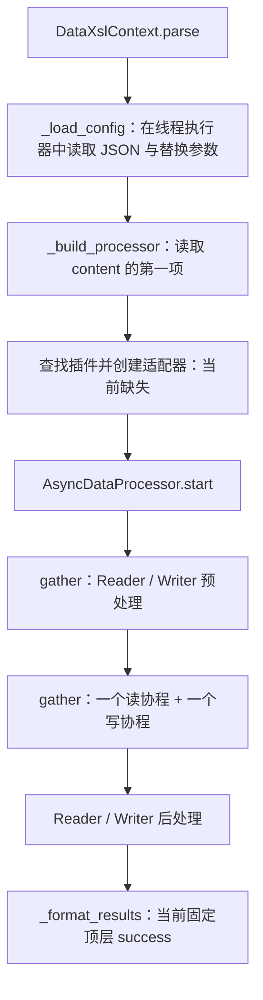
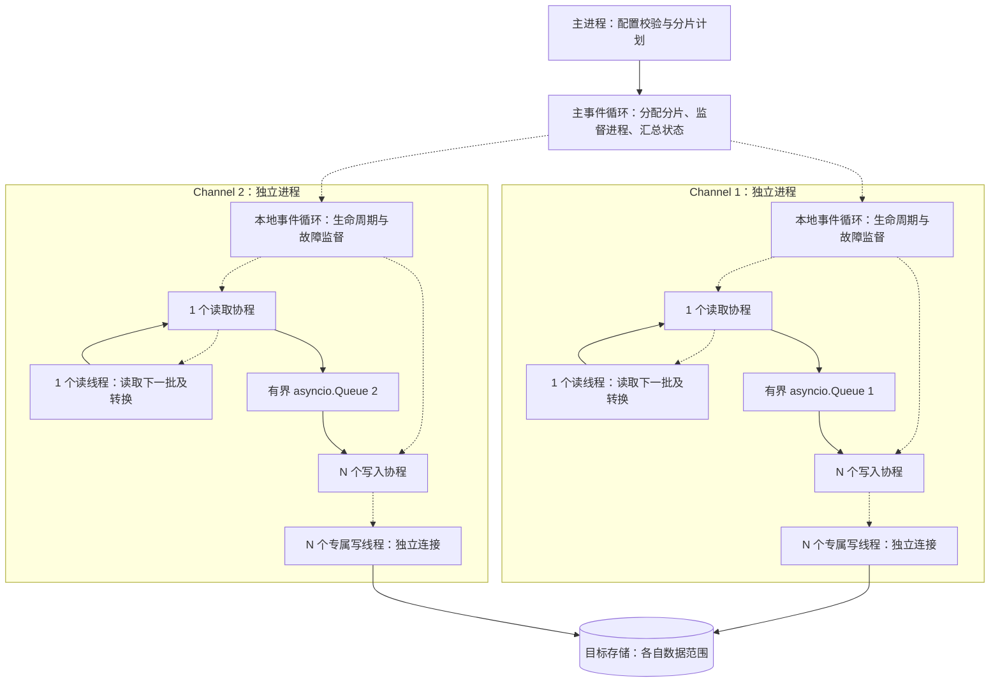

# DataXSL 异步混合模型架构方案

> 更新日期：2026-09-17。本文记录已确认的编码目标：协程调度、独立通道进程、通道内有界异步队列和一读多写线程。目标尚未实现；第 2 节保留 2026-09-16 对 `main_async.py` / `src/aiodataxsl` 的源码分析，不表示已按此方案改造。
> 简单转换使用 [多进程模型](architecture-multiprocess.md)，该模型不按 channel 分片。

## 1. 定位与已确认决策

DataXSL 是离线数据转换工具。异步入口面向按键分片及高并发转换，采用“**主进程协程调度 → 有限个通道进程 → 通道内协程协调队列 → 线程执行读写**”的层次。

| 参数 / 概念 | 明确语义 |
| --- | --- |
| `channel=C` | 最多同时运行 C 个通道，每个通道占用一个独立进程 |
| `parallel=N` | 每个通道内固定 1 个读线程 + N 个写线程；N 不包含读线程或事件循环线程 |
| `queue_size=Q` | 每个通道的 `asyncio.Queue(maxsize=Q)` 容量，按批次数计，必须大于 0 |
| `chunk_size=B` | Reader 单次读取及转换的批次行数 |
| 分片数 M | 本次数据被划分的任务数量，独立于通道数；可以 M 远大于 C |
| 文件数据源 | 暂按一个通道处理，不切分文件 |
| 数据库数据源 | 按主键或辅助键生成分片，由可用通道领取执行 |

固定 N 个写线程，通过队列等待与唤醒协调读写节奏；第一版不做动态扩缩线程。协程恢复可继续执行的任务，不按队列长度自动调整 CPU 配额或进程数。

`channel=4, parallel=4` 表示最多 4 个通道进程、共 4 个读线程与 16 个写线程，以及 4 条异步队列；另有主协调进程、主事件循环及各通道本地事件循环。一个通道的逻辑 Writer 对应 N 个独立写执行实例。

## 2. 当前源码结构与完成度

| 路径 | 当前职责及状态 |
| --- | --- |
| `main_async.py` | `asyncio.run(main())` 启动事件循环，解析 `--job`、`--param`；调用 `parse()` 时缺少 `await` |
| `src/aiodataxsl/core.py` | DataXslContext 加载配置和尝试构建适配器；AsyncDataProcessor 协调读写协程 |
| `src/aiodataxsl/reader.py` | AsyncReader 接口：`read_async(queue)`、`validate()`、`pre_deal()`、`post_deal()` |
| `src/aiodataxsl/writer.py` | AsyncWriter 接口：`write_async(queue)`、`validate()`、`pre_deal()`、`post_deal()` |
| `src/aiodataxsl/excel/excel_reader.py` | AsyncExcelReader 草稿：解密、分批读取、DataFrame 转换及异步入队 |
| `src/aiodataxsl/excel/excel_writer.py` | 空文件 |
| `src/aiodataxsl/mysql/` | Reader / Writer 文件为空，尚无异步数据库输出实现 |
| `src/aiodataxsl/register.py`、`utils.py` | 空文件 |
| `src/aiodataxsl/logging_config.py`、`error.py` | 日志配置加载及参数异常 |
| `setup.py` | 显式包列表目前只包含同步 `dataxsl` 包，异步包发布方式需补齐 |

同步包中的 ExcelReader、TextReader 和 MySQLWriter 可以作为后续复用候选，但目前缺少适配与装配链路，不能据此宣称异步版已经支持这些完整数据路径。

### 2.1 当前入口的实际行为

1. `asyncio.run(main())` 进入协程入口。
2. 解析 `--job` 与 `--param`，创建异步 DataXslContext。
3. `result = context.parse(args)` 仅创建协程对象，没有 `await`，不会进入配置解析和转换流程。
4. 打印的是协程对象，而非作业执行结果。

补上 `await` 之后仍有构建缺口，不能仅修复入口就认为链路可运行。

### 2.2 草稿内部的处理结构

以下描述的是方法内部编排，不代表入口已能完整执行：



AsyncDataProcessor 内部只有一条容量写死为 1000 的 `asyncio.Queue`；不存在按 `channel` 创建隔离通道、按 `parallel` 创建 N 个写线程的实现。

### 2.3 主要实现缺口

| 问题 | 当前影响 |
| --- | --- |
| 入口缺少 `await context.parse(args)` | 作业协程未执行 |
| Context 使用 PluginRegistry 但未导入，异步注册器为空 | 插件构建无法完成 |
| 引用的 `dataxsl.async_adapter.AsyncAdapter` 不存在 | 同步插件适配路径未实现 |
| Context 传入 `max_concurrent`，AsyncDataProcessor 构造器不接收 | 构造调用不兼容 |
| 读取 `setting.speed.channel` 并赋给 `max_concurrent` | 未形成通道语义，且与同步扁平 setting 结构不一致 |
| Writer 文件为空，无线程角色管理 | 无完整输出链路，未落实一读多写 |
| `_format_results()` 固定顶层 `success` | 子任务非零状态不能正确反映为作业失败 |
| `stop()` 只设置事件，读写循环未检查该事件 | 取消未形成有效退出协议 |
| 成功/失败后的业务后处理与资源清理未分离 | 失败时可能错误执行后处理或遗漏清理 |

AsyncExcelReader 还有一个执行位置问题：`read_sync()` 是生成器函数，在执行器中调用它只返回生成器；后续 `for df in data_generator` 位于协程中，实际读取及 DataFrame 构造仍会在事件循环线程执行。`await asyncio.sleep(0)` 只在批次之间让出执行权，不能把一批内部的阻塞工作移入读线程。

该读取器只在正常结束时发送一个 `None`；异常路径可能没有结束通知，也不满足 N 个消费者的退出需要。以上为 2026-09-16 静态阅读结论，未进行异步端到端执行验证。

## 3. 目标架构与模块边界（待编码）



虚线表示调度或调用，实线表示数据处理路径。线程返回的批次由本地读取协程入队；N 个写入协程竞争领取批次，然后各自等待对应写线程完成。

### 3.1 控制消息与业务数据分离

- 主进程负责配置、分片描述、启动/停止指令、心跳、统计和结果汇总。
- 业务数据由通道进程直接从源读取、直接向目标写入，不经主进程中转。
- 进程间使用明确的 IPC 消息传递控制与结果；不跨进程共享 asyncio.Queue、事件循环或数据库连接。
- 在通道子进程内创建本地事件循环、线程执行器和连接，禁止传入父进程已有的活动连接或线程对象。
- 可以使用明确的 `spawn` 启动方式，入口保留 `__main__` 保护；进程入口及参数必须可序列化。

### 3.2 建议职责划分

| 模块 | 编码职责 |
| --- | --- |
| ConfigLoader / JobConfig | 变量解析、旧配置兼容、严格校验和默认值合并，不产生目标副作用 |
| SplitPlanner / JobPlan | 生成覆盖完整数据范围且互不重叠的分片，不创建对应数量的进程 |
| AsyncJobRunner | 管理有限个通道进程、分配分片、监督退出、执行作业级前后 SQL 和汇总结果 |
| ChannelProcess | 子进程入口，创建本地事件循环与运行资源，收发分片和结果消息 |
| AsyncChannelRunner | 启动读取/写入协程，持有有界异步队列，监督失败、排空和结束 |
| ReaderWorker | 专属读线程，负责连接/文件打开、读取下一批、必要转换及关闭 |
| WriterWorker | 每个实例一个专属写线程与独立连接，按批写入并提交 |
| Batch / ReadResult | 批次数据与来源标识；读取结果明确区分数据和 EOF |
| ChannelResult / JobResult | 状态、已提交行数、失败、耗时及资源清理结果 |

这些名称是职责建议。同步插件不能直接作为完整长循环塞进共享线程池；应提取 `open / read_next_batch / write_batch / close` 等可逐批调用的能力。

## 4. 有界异步队列与负载协调

### 4.1 队列所有权

每个通道创建一条 `asyncio.Queue(maxsize=queue_size)`，仅由该通道本地事件循环中的协程操作。工作线程不调用队列方法，也不通过 `.result()` 等方式等待协程入队或出队。

读取协程先等待读线程返回一批，再 `await queue.put(batch)`；写入协程先 `await queue.get()`，再等待对应写线程完成写入。`await` 无需等待时可以立即完成，需要等待时挂起当前协程。异步队列不是线程安全队列，参考 [Python asyncio 队列文档](https://docs.python.org/3/library/asyncio-queue.html)。

### 4.2 根据队列状态协调读写

| 状态 | 读取协程 | 写入协程 |
| --- | --- | --- |
| 队列为空 | 继续等待或发起下一批读取 | 空闲消费者挂起在 `queue.get()` |
| 非空且未满 | 可读取并入队 | 空闲消费者领取批次，等待自己的写线程 |
| 队列已满 | 挂起在 `queue.put()`；入队完成前不再发起读取 | 完成当前写入后继续领取，释放容量 |
| 产生空位 | 等待入队的生产者可恢复 | 其他读写任务继续推进 |
| 任一任务失败 | 由监督器停止新读取并取消队列等待 | 停止领取新批次，处理在途操作与清理 |

这就是背压与异步唤醒：队列条件决定哪些协程需要等待，事件循环调度可继续执行的任务。它不会自动扩缩线程或在 channel 进程之间搬移数据。

### 4.3 非阻塞语义及禁止事项

- “非阻塞”指等待队列或 I/O 结果时不阻塞事件循环，不表示数据处理永远无需等待，也不要求实现无锁队列。
- 使用 `await put/get` 的等待机制，不通过 `while True + get_nowait/put_nowait` 忙轮询。
- 不通过反复查询 `qsize()` 决定是否允许入队；容量由队列自身约束，`qsize()` 仅用于观测。
- 队列必须有界；不使用 `maxsize=0` 来掩盖读写速度差异。
- 不在获取批次后无限 `create_task(write_batch(...))`；每个消费者当前批次完成后才能领取下一批。
- `await asyncio.sleep(0)` 不能替代真正的阻塞工作卸载；文件读取、生成器迭代和数据库调用必须在线程中执行。

线程适配和事件循环的执行边界参考 [Python asyncio 开发说明](https://docs.python.org/3/library/asyncio-dev.html)。

### 4.4 在途批次与吞吐

在“单批读取、每消费者最多一批”的设计下，单通道通常最多持有 Q 个排队批次、N 个正在写入的批次和 1 个读取/等待入队的批次，即约 `Q + N + 1` 个应用层批次。此估算不包含驱动缓冲、整个工作簿、DataFrame 转换副本或底层库缓存，不能作为内存硬上限。

写得快的消费者完成后立即领取下一批，写得慢的消费者继续处理当前批次，由此自然分摊负载，无需预先向每个 Writer 平均分配行数。多写线程主要重叠 I/O 等待；数据库已受锁、磁盘或连接能力限制时，增加 N 不保证继续提高吞吐。

## 5. 线程执行与编码骨架

### 5.1 固定线程及资源归属

- 一个专属读线程负责源连接/工作簿的创建、下一批迭代、转换与关闭。
- 每个 WriterWorker 拥有一个专属写线程，在同一线程创建、使用和关闭独立连接。
- 可用一个单线程执行器承载 Reader、N 个单线程执行器分别承载 Writer，以明确线程亲和性；不依赖共享线程池恰好把连续调用分配给同一线程。
- 执行器只运行本批读写或资源操作，不运行等待队列的长期任务。每个 worker 同时最多一个在途调用，避免执行器内部另行积压。
- 工作线程返回数据或结果，队列及协程 Future 由事件循环管理。读取 EOF 使用显式结果，不将生成器 `StopIteration` 直接传到异步 Future。

### 5.2 逐批调度骨架

下列为编码指导骨架，不是现有接口或完整可运行实现。`worker.call()` 表示向该 worker 的专属线程提交一次操作并异步等待；资源已由生命周期管理器打开，清理和异常监督由第 6 节约束。

```python
async def produce(reader, queue, writer_count):
    while True:
        result = await reader.call("read_next_batch")
        if result.eof:
            break
        if result.batch is not None:
            await queue.put(result.batch)
    for _ in range(writer_count):
        await queue.put(END)


async def consume(writer, queue):
    while True:
        item = await queue.get()
        try:
            if item is END:
                return
            # 返回成功前已完成该批提交；失败必须抛异常。
            await writer.call("write_batch", item)
            record_committed(item)
        finally:
            queue.task_done()
```

编码必须同时落实：

1. 每条流水线创建 1 个 producer 协程与 N 个 consumer 协程，使用同一通道队列；END 只用于正常完成。
2. 监督器同时观察所有协程。任何任务失败都要停止同组任务，不能顺序等待 Reader 后才检查 Writer。
3. `(非零状态, 异常)` 等插件返回值在适配层转为异常；不能把失败返回值作为成功继续执行。
4. 正常完成需要 producer、全部 consumer、批次处理和资源关闭均成功；`queue.join()` 单独完成不代表导入成功。
5. `task_done()` 只用于队列记账，失败批次也可结束记账；只有确认提交的批次才能计入成功写入数。
6. `worker.call()` 取消时必须保留实际线程操作的完成记录，不能因外层协程取消就丢失对在途操作的监督。

## 6. 生命周期、异常与数据契约

### 6.1 作业和分片生命周期

1. 主进程校验配置、插件及分片计划，执行一次作业级预处理。
2. 启动最多 C 个通道进程。每个子进程创建本地循环、读写线程、队列和独立运行上下文。
3. 向空闲通道发送分片描述；Reader 在线程内打开对应源范围，Writer 在线程内创建所需连接。
4. 通道运行一读多写流水线，正常结束时发送 N 个 END；等待全部批次与写入完成。
5. 本分片的读取、写入及必要清理均完成后向主进程报告成功，再领取下一分片。新分片重建批次状态和结束标记，线程与进程可复用；不混用上一个分片未排空的队列。
6. 全部分片成功后，主进程执行一次作业级后处理，关闭通道并汇总结果。
7. 所有路径都执行资源清理；业务后处理仅在成功路径执行。

### 6.2 故障与取消协议

- 通道中的任一生产/消费协程失败，立即停止新批次调度，并取消其他协程的队列等待；不等待向已满队列塞入结束标记。
- 第一版建议采用作业失败即整体停止：主进程停止分配分片，通知其他通道停止，结果保持失败；不自动重试有部分提交的分片。
- 取消协程不代表线程中的数据库调用已结束。设置驱动连接/读写超时，向工作线程传递线程安全停止标志，在批次边界检查，并监督在途操作完成。
- 不在数据库操作仍运行时，从另一线程关闭其连接。由所属线程在操作结束后回滚可回滚的事务并关闭资源。
- 停止与关闭执行器、等待进程退出也不能直接阻塞事件循环。应使用可异步等待的管理方式，并设置清理期限。
- 超过期限的通道进程可由父进程终止并回收；状态记为失败或写入结果不确定，不能据此推断数据库已回滚。
- 若提交结果不确定，禁止直接盲目重放批次；需通过业务键、暂存表或对账确定重跑策略。

### 6.3 数据与状态契约

- Batch 建议包含 job_id、channel_id、split_id、batch_id、行数及 DataFrame；入队后生产侧不再修改它。
- Reader 的字段顺序、类型与目标映射必须显式校验。常量字段和转换可放在读线程的批次构造阶段。
- 每批由一个消费者处理，正常执行不广播、不重复分配；这不等于跨故障场景的 exactly-once 保证。
- 连接与事务归对应写线程管理；部分批次已经提交时，其他批次失败不会将整个作业回滚。
- 多写线程不保证全局写入顺序；需要顺序的数据使用单写或另行设计有序分配。
- 成功行数只统计已确认提交的数据，错误、取消、清理失败和进程异常退出均须体现在 ChannelResult / JobResult 及 CLI 退出码中。

## 7. 分片与资源隔离

### 7.1 分片数量与通道数量分离

先确定源数据的离线快照或业务截止范围，再按主键范围或辅助键生成 M 个分片。分片谓词必须互不重叠且完整覆盖范围，处理空值、重复辅助键和分布倾斜。

例如固定范围 `1 <= id < 3001` 可以划为 `[1,1001)`、`[1001,2001)`、`[2001,3001)`。大量分片仍只由最多 C 个通道进程执行；完成一个分片的通道再领取下一个。协程负责调度等待，不会把分片计算或同步源查询自动变成非阻塞操作。

文件暂不分片，配置建议要求 `channel=1`；大于 1 时明确提示不支持，不静默制造重复读取。

### 7.2 隔离边界

- 每个通道独享进程、本地事件循环、异步队列、线程、连接、批次状态、停止标志和临时资源。
- 数据不能跨通道消费；跨进程只传控制信息、分片描述和结果统计，不中转业务 DataFrame。
- 允许通道写同一目标表的不同数据范围，但必须避免转换后的目标键冲突；进程隔离不等于数据库事务隔离。
- 全表清理等 `pre_sql` 由主进程在分配分片前执行一次；全局 `post_sql` 在全部通道成功后执行一次。分片级 SQL 必须显式限定范围，禁止重复清理其他通道的数据。

### 7.3 资源预算

同时活跃通道数为 A（A ≤ C）时，数据处理资源约为 A 个通道进程、A 个读线程、A×N 个写线程和 A 条异步队列，另有主进程及各事件循环所在主线程。

若数据库 Reader 与每个 Writer 各使用一条连接，工作连接预算约为 `A × (1 + N)`，需额外考虑分片查询、前后 SQL 和管理连接。文件 Reader 不占源数据库连接。限制 C、N、Q 和批次大小，避免多通道叠加内存及数据库压力。

## 8. 配置、接口与工程要求

### 8.1 配置协议

统一使用 `job.setting.channel / parallel / queue_size`，旧 `setting.speed` 只在加载层兼容。以下仅为目标 setting 片段，不是完整可运行 Job：

```json
{
  "channel": 2,
  "parallel": 4,
  "queue_size": 10
}
```

表示数据库作业最多启动 2 个通道进程，每通道 1 个读线程、4 个写线程和容量为 10 批的异步队列。Reader 的 `chunk_size` 单独定义每批行数。三个 setting 参数必须是正整数，拒绝布尔值、零和负数。

分片数量由分片计划决定，不等于 channel；初期不必为所有内部策略增加公开参数。`job.content` 的多项作业与同一作业的多个分片也需区分，第一版建议只接受一个 content 项，其余明确报错。

### 8.2 插件与接口迁移

- 从同步插件提取逐批读写能力，再接入线程适配层；现有 `read_parallel(queue)` / `writer_parallel(queue)` 长循环不能直接接到 asyncio.Queue。
- 确定 EOF、空批次、异常、批次写入成功和关闭失败的统一返回/异常契约。
- 保留 CLI 已声明的 `--job` / `--param`，补齐 await、参数模板严格校验及失败退出码。
- 统一依赖、Python 版本范围和打包方式；现有 setup.py 尚未包含完整异步包及运行依赖。
- 队列终止方案以正常 END 和失败取消为基线，不默认依赖特定新版本的 Queue.shutdown 接口。

### 8.3 日志与监控

记录 job_id、channel_id、split_id、worker_id 和 batch_id；敏感参数统一脱敏，临时文件按运行和通道隔离。

至少采集读取/提交/失败行数、批次数、队列占用、等待入队时长、等待取数时长、批次读取/写入耗时、活动线程与连接数，以及进程内存。

- 队列长期接近满且写入耗时高：检查目标库余量，再评估增加 N 或优化批量提交。
- 队列长期为空且 Writer 空闲：检查读取或转换速度，增大 N 通常无益。
- 同时结合实际提交吞吐判断，不能只凭队列长度推断数据库瓶颈。

## 9. 实施顺序与验收清单

| 阶段 | 实施内容 | 验收依据 |
| --- | --- | --- |
| 1. 逐批插件与装配 | 入口 await、注册/适配、参数校验、读写及关闭接口 | 最小样例完成实际读写；非法配置无目标副作用 |
| 2. 单通道异步流水线 | 本地事件循环、有界 asyncio.Queue、1 读线程/N 写线程 | 线程归属明确，读写及生成器迭代不在事件循环中阻塞 |
| 3. 背压与故障 | 同组任务监督、END、取消、在途线程清理 | 空/满队列、失败、取消均能结束，不遗留工作线程或误报成功 |
| 4. 通道进程与分片 | 父子进程协议、有限通道、分片复用、全局 SQL | 分片不重不漏，无跨通道数据，多分片不导致进程数超过 C |
| 5. 工程化与压测 | 日志、依赖、指标、自动化验证与资源预算 | 能用提交吞吐、延迟与内存比较 C/N/Q/B 的实际效果 |

后续测试必须覆盖：

1. `parallel=1/4` 时，每通道读线程分别固定为 1、写线程分别为 1/4；打开、读写和关闭保持对应线程归属。
2. 空队列消费者等待期间，事件循环心跳继续；生产者放入数据后消费者恢复。
3. 慢写导致队列满时，生产者在入队处挂起，最多保留一批待入队数据，不继续无限预读；释放容量后恢复。
4. 快慢 Writer 混合时，快消费者可以继续取数；所有正常批次恰好由一个消费者处理，分配不要求平均。
5. 每消费者最多一个在途写操作；任意时刻队列长度不超过 Q，任务与执行器等待列表不随总行数增长。
6. 读取失败、写入失败、提交结果不确定、外部取消及通道进程崩溃都返回非成功；满队列和空队列场景均可清理退出。
7. EOF、空数据与尾批次正确结束；N 个消费者均能退出，queue.join 完成不能掩盖写入错误。
8. M 个分片在最多 C 个通道进程中完成；分片间无残留结束标记或批次，进程可复用。
9. 主进程只传分片与控制/结果消息；父子进程连接、线程对象和业务批次不混用。
10. 预处理一次、全成功后后处理一次；失败路径不执行成功发布，不把部分提交解释为整体回滚。

## 10. 验证记录与变更边界

2026-09-16 静态核对异步入口、核心、抽象接口与 ExcelReader，记录第 2 节的实现缺口，未执行异步业务导入。

2026-09-17 按确认方案补齐独立通道进程、有界异步队列、固定一读多写线程、逐批调度骨架、错误退出和验收清单，并同步修订多进程版及导航的职责边界。

本轮仅修改架构文档，检查链接、章节、代码块和 JSON 示例；没有修改运行代码、连接业务数据库或开展性能压测。方案与验收项用于指导后续编码，不表示现有代码已满足要求。
