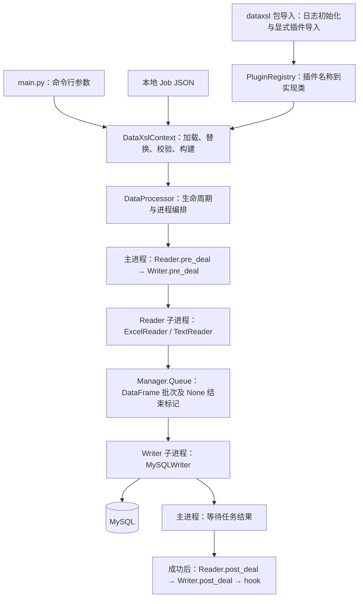
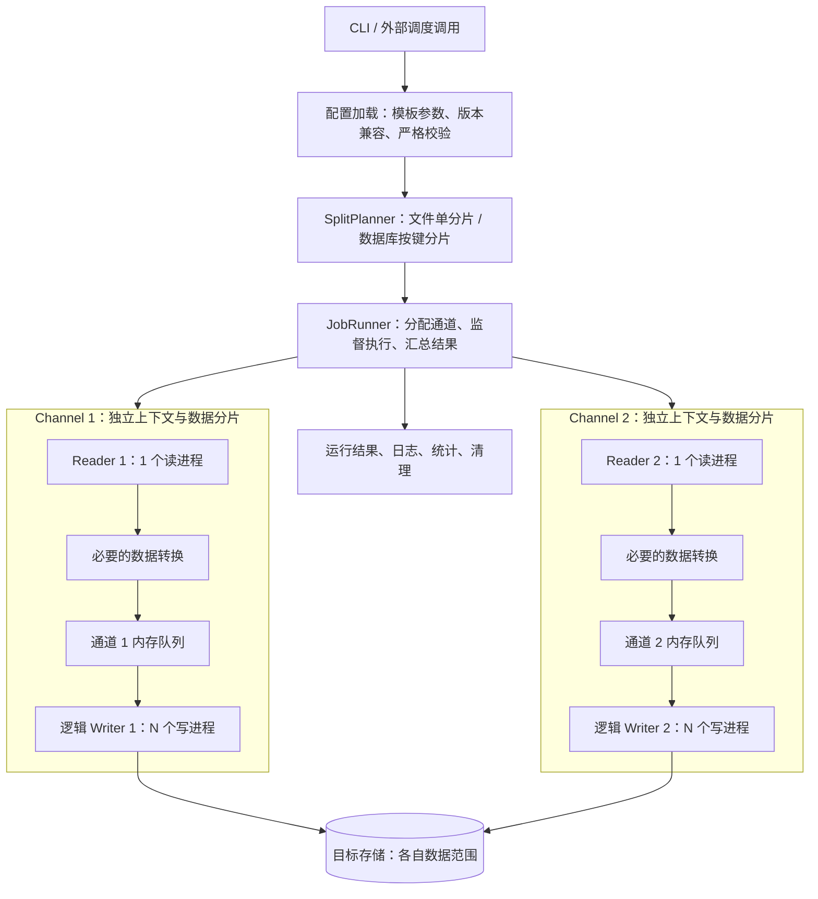

# DataXSL 多进程模型架构方案

> 更新日期：2026-09-16。本文针对 `main.py` / `src/dataxsl`，保留 2026-09-15 源码梳理与局部验证结论。设计目标、当前实现和建议方案分别标明；规划能力尚未实现。
> 异步模型见 [异步模型架构方案](architecture-async.md)。

## 1. 项目定位与结论

DataXSL 的原始定位是**离线数据转换工具**：通过本地 JSON 作业描述，将数据从一种介质读取、进行必要转换并写入另一种介质。现有业务样例集中在投资账户、持仓、交易流水及委托投资报表的数据导入。

核心结构为：**命令行入口 → 作业解析与插件构建 → 生命周期编排 → Reader → DataFrame 队列 → Writer**。

- 当前主要实现路径是 Excel / 分隔文本到 MySQL；Excel 读取包含密码文件解密、表头识别、选列和空值处理。
- 插件通过抽象基类与注册器解耦，但目前只有 `excel_reader`、`text_reader`、`mysql_writer` 完成注册且具备实质逻辑。
- 执行器按“一生产者、多消费者”编写；主入口配置传递存在缺口，实际默认执行一个 Reader 和一个 Writer。
- 转换能力分布在 Reader 和 Writer 内部，没有独立的 Transformer 层。
- 当前是单机、单次作业工具。源码没有作业调度服务、DAG 编排、状态持久化、断点续传或分布式执行实现。

### 1.1 已确认的设计语义

| 参数 / 概念 | 多进程模型语义 |
| --- | --- |
| `channel=C` | C 个数据隔离的通道，每通道一组逻辑 Reader / Writer 和独立队列 |
| `parallel=N` | 每通道 1 个读进程 + N 个写进程；N 不包含读进程 |
| 文件数据源 | 暂按一个通道处理，不做文件分片 |
| 数据库数据源 | 后续按主键或辅助键分片到各通道，实现并发转换 |
| `queue_size` | 每通道内存队列可容纳的批次数 |
| `chunk_size` | Reader 每批处理的行数 |

一组逻辑 Reader / Writer 描述插件组合；N 个写进程是 Writer 的执行实例。建议各进程独立持有数据库连接和运行状态。

例如 `channel=2, parallel=4` 的目标规模是 2 个读进程、8 个写进程和 2 条独立队列，不包含主协调进程和 Manager 服务进程。当前配置传递缺口见第 4 节。

## 2. 目录与模块职责

| 路径 | 职责及状态 |
| --- | --- |
| `main.py` | 正式分析入口：参数解析、版权输出、作业启动、错误退出和总耗时记录 |
| `src/dataxsl/__init__.py` | 初始化日志，显式导入插件模块，触发装饰器注册 |
| `src/dataxsl/core.py` | `DataXslContext` 解析配置和构建对象；`DataProcessor` 编排生命周期与进程 |
| `src/dataxsl/reader.py`、`writer.py` | Reader / Writer 抽象接口 |
| `src/dataxsl/register.py` | 名称到插件类的注册与查找 |
| `src/dataxsl/excel/` | ExcelReader 实现；ExcelWriter 占位 |
| `src/dataxsl/txt/` | TextReader 实现；TextWriter 占位 |
| `src/dataxsl/mysql/` | MySQLWriter 实现；MySQLReader 占位 |
| `src/dataxsl/oracle/` | OracleReader / OracleWriter 占位 |
| `src/dataxsl/utils.py` | AES 密文处理、基础数据类型转换 |
| `src/dataxsl/error.py` | 缺失参数和参数类型异常 |
| `src/dataxsl/logging_config.py`、`config/` | 按环境加载 YAML 日志配置及回退配置 |
| `tests/data_json/` | 业务作业样例，部分为空或使用旧配置格式 |
| `tests/data/`、`tests/script/` | 业务输入文件及 Shell / BAT 启动脚本 |
| `setup.py` | setuptools 包定义，显式打包同步 `dataxsl` 包 |
| `build/`、`dist/` | 构建输出，不作为本次源码判断依据 |

## 3. 现有逻辑架构



队列是内存中的进程间通信组件，不持久化数据。Reader 负责形成批次，Writer 负责消费批次。队列满时 `put()` 阻塞，从而限制在途批次数；这不等于对整个 Excel 工作簿的内存占用有硬限制。

### 3.1 主入口调用链

1. 导入 `dataxsl.core`，先执行包的 `__init__.py`：初始化日志，并显式导入各插件模块。
2. `main.py` 在 `__main__` 保护下调用 `freeze_support()`，然后解析 `-job` 和可重复的 `-p / --param`。
3. 缺少 `-job` 时打印帮助并以 `sys.exit(-1)` 退出。
4. 创建 `DataXslContext`，调用 `parse(args)`。
5. `parse()` 读取本地 JSON 文本，将 `-p key=value` 转换为字典，并通过 `Template.safe_substitute()` 替换 `$key` / `${key}`。
6. `json.loads()` 解析替换后的文本，再调用 `_validate()` 校验。
7. 仅提取 `job.content[0]` 的 Reader、Writer 和参数；处理部分运行参数后调用 `__construct__()`。
8. 根据插件名称从 `PluginRegistry` 获取类，实例化 Reader、Writer 和 DataProcessor。
9. `processor.start()` 完成预处理、并行搬运、后处理及空的 hook。
10. 正常返回后记录结束日志和总耗时；传播到入口的普通异常会记录并以 `-1` 退出。成功退出码由 Python 正常结束得到，入口未主动检查返回元组。

注意：`parse()` 同时负责解析和执行，会触发数据库操作；它不是无副作用的配置读取函数。尽管 CLI usage 文本提到 URL，实际只通过 `os.path.exists()` 和 `open()` 读取本地文件。

### 3.2 生命周期与事务位置

| 阶段 | 执行位置 | 当前行为 |
| --- | --- | --- |
| Reader 预处理 | 主进程 | ExcelReader 解密 Office 文件，必要时先解密 `ENC(...)` 形式的密码 |
| Writer 预处理 | 主进程 | MySQLWriter 使用独立连接执行 `pre_sql` 并提交 |
| 数据读取 | Reader 子进程 | 生成 DataFrame，写入共享队列 |
| 数据写入 | Writer 子进程 | 建立自己的 MySQL 连接，逐批执行 `executemany()` 并提交 |
| Reader 后处理 | 主进程 | 成功路径删除解密后的 Excel 文件 |
| Writer 后处理 | 主进程 | 使用另一个独立连接执行 `post_sql` 并提交 |
| 回调 | 主进程 | `invoke_hook()` 当前为 `pass` |

预处理、各批次写入和后处理不在同一事务中。前面已提交的批次不会因后续批次失败而整体回滚。若 `pre_sql` 清理旧数据后导入失败，可能留下不完整结果。

## 4. 进程模型与数据契约

### 4.1 当前实现结构及与设计目标的差距

`DataProcessor.process_data()` 创建 `ProcessPoolExecutor(max_workers=parallel + 1)`，提交一个 Reader 任务和 `parallel` 个 Writer 任务。另有 `Manager()` 服务进程承载共享队列。

这里源码用 `parallel` 创建 Writer **进程**，符合作者对非异步入口“一读进程对 N 写进程”的设计。当前缺口在配置传递，以及尚未实现独立 Channel 对象、按键分片器和每通道一条队列，不能把现有进程池直接视为多通道执行器。

但 `DataXslContext.parse()` 没有把 `job.setting.parallel` 写入 `process_config.parallel`，只赋给 Reader；`queue_size` 也没有从作业配置传给执行器。

| 配置 | 源码中的实际去向 | 当前主入口效果 |
| --- | --- | --- |
| `job.setting.channel` | `process_config.channel` | DataProcessor 不读取，无执行效果 |
| `job.setting.parallel` | `reader_config.parallel` | 控制 Reader 发送的结束标记数；不改变 Writer 进程数 |
| `job.setting.queue_size` | 未读取 | 执行器仍使用默认 10 |
| Reader `chunk_size` | 传给 Reader 构造器 | 控制每批行数，默认 1000 |
| `process_config.parallel` | DataProcessor 读取 | Context 默认 1 且未由 Job 更新，故通常只有一个 Writer |

当前应将 `setting.parallel` 保持为 `1`，避免 Reader 的结束标记数量与消费者数量不一致。不能通过增大 `channel` 或 `parallel` 就认定吞吐已提升。

### 4.2 当前接口约定

- Reader 实现 `read_parallel(queue)`、`pre_deal()`、`post_deal()`、`validate(config_data)`。
- Writer 实现 `writer_parallel(queue)`、`pre_deal()`、`post_deal()`、`validate()`；注意现有方法拼写就是 `writer_parallel`。
- 数据消息为 pandas DataFrame；`None` 为消费者结束标记。
- 读写任务正常完成返回 `(0, None)`，失败通常返回 `(1, exception)`；预处理、连接建立等位置也可能直接抛异常。
- 主进程按提交顺序调用 Future 的 `result()`，首先等待 Reader；遇到非零状态尝试抛出异常。
- 没有批次 ID、统一字段 schema、确认消息、重试次数、错误数据通道或检查点。

Reader/Writer 作为对象提交给进程池，插件实例必须能够跨进程序列化。MySQLWriter 在工作进程内建立写入连接，符合这一边界。

### 4.3 字段映射方式

MySQLWriter 用 `writer.parameter.column` 构建目标字段列表，但通过 DataFrame 每行的 `values` 取值，不按目标字段名重排列。

例如：DataFrame 列顺序为 `[账户, 金额]`，追加 `additive_attr={"biz_date": "2026-09-15"}` 后，实际值顺序为 `[账户值, 金额值, 日期值]`，目标 `column` 必须按对应顺序配置为 `[account, amount, biz_date]`。

`additive_attr` 遇到已有同名列会覆盖该列；新增列按字典迭代顺序追加。因此当前契约依赖**列数量和位置一致**，并非基于字段名称的显式映射。

## 5. 插件能力与边界

| 插件名称 / 类 | 注册情况 | 实现状态 |
| --- | --- | --- |
| `excel_reader` / ExcelReader | 已注册 | Office 解密、按 Sheet 读取、分批、表头/跳行/选列、空值处理、可添加 IDX |
| `text_reader` / TextReader | 已注册 | 分隔文本与压缩分支、指定列类型转换；存在配置与压缩读取问题 |
| `mysql_writer` / MySQLWriter | 已注册 | 参数化数据值的 INSERT、批量提交、附加字段、前后 SQL |
| MySQLReader、OracleReader | 未注册 | 构造器及生命周期主要为 `pass`，读取仅返回占位字符串 |
| ExcelWriter、OracleWriter、TextWriter | 未注册 | 无真实写入逻辑，返回占位字符串 |

被 `__init__.py` 导入不代表已注册；只有带注册装饰器的类进入注册器。占位实现的返回值也不符合 `(整数状态码, 异常)` 的执行契约。

### 5.1 ExcelReader

- 使用 `python_calamine.CalamineWorkbook` 打开文件，通过 Sheet 的 `iter_rows()` 遍历并积累批次。
- `header` 是从 0 开始的表头行索引；表头行及其之前的行不会进入数据批次。
- `skip_rows` 接受单个整数或整数列表，按遍历行的零基索引跳过指定行，不表示“跳过前 N 行”。
- `use_cols` 通过 `df.iloc[:, use_cols]` 选列；若启用 `ins_row_num`，先在最前面加入 `IDX`，再选列。
- `_convert_cell()` 将可整除的浮点数转为整数，将空字符串转为 `None`，随后进行 pandas 空值替换。
- 加密文件输出到原文件目录下的 `<文件名>_decrypted.<扩展名>`；该路径并非每次运行独享。
- `encode` 参数目前没有实际读取效果；JSON 中的 `column` 类型声明会被 Context 丢弃，并未用于 Excel 类型转换。

已识别的行为限制：`IDX` 每个批次从 1 重新计数；尾批次 `dropna(how='all')` 没有接收返回值，空行过滤与完整批次不一致；加入 IDX 后全空业务行也不再是全空行。

### 5.2 TextReader

- 逐行 `strip()`，跳过空行和以 `#` 开头的行，用 `split(field_delimiter)` 分列；不处理标准 CSV 的带引号分隔符、多行字段等语法。
- 不自动跳过表头，生成的 DataFrame 列名为 `col_0`、`col_1` 等。
- 类型配置名是 `columns`，单项读取 `index`、`type`、`format`，与 Context 处理的 `column` 不是同一字段。
- 当前分派支持 `int`、`decimal`、`string`、`boolean`、`date`、`datetime` / `timestamp`；其他类型回退为字符串。工具类虽有 float/time 转换函数，这个分派尚未接入。
- ZIP 选择归档中的第一个 `.txt` 文件；密码传给 ZIP 读取器。
- gzip / bzip2 以文本模式打开，但公共读取逻辑再次调用 `.decode()`，存在类型冲突；注释中提及的 rar / 7z 没有实现。
- 普通文本读取生成器捕获错误后只记录日志，外层可能仍返回成功；部分类型转换失败直接变为 `None`。

此外，Context 的 schema 枚举没有 `text_reader`；虽然当前校验不会阻止执行，仍不应把它视为完整的配置支持。

### 5.3 MySQLWriter

- `db_config` 传给 `pymysql.connect()`；必须提供 `table`、`column` 等参数。
- SQL 为普通 `INSERT INTO ... VALUES (%s, ...)`，每批调用 `executemany()` 后提交。
- `pre_sql` / `post_sql` 可配置字符串或列表，各自使用独立连接。
- `additive_attr` 将运行日期、来源标识等常量加入每一行。
- 数据库密码支持 `ENC(...)` 形式，但解密密钥存放在源码中。
- 样例中的 `writerMode`、`session` 没有被实现逻辑使用，不能据此认为支持 upsert、replace 或会话参数设置。

## 6. 配置协议与启动方式

### 6.1 当前可对照的 Excel → MySQL 配置骨架

下例用于说明当前代码所需字段；路径、表结构和凭据需由运行环境提供，未执行数据库导入验证。

```json
{
  "job": {
    "setting": {"channel": 1, "parallel": 1, "queue_size": 10},
    "content": [
      {
        "reader": {
          "name": "excel_reader",
          "parameter": {
            "path": "${input_path}",
            "sheet_name": "Sheet1",
            "header": 0,
            "chunk_size": 1000,
            "use_cols": [0, 1],
            "column": [{"index": 0, "type": "string"}]
          }
        },
        "writer": {
          "name": "mysql_writer",
          "parameter": {
            "table": "etl_demo",
            "column": ["account", "amount", "biz_date"],
            "additive_attr": {"biz_date": "${biz_date}"},
            "pre_sql": [],
            "post_sql": [],
            "db_config": {
              "host": "${db_host}",
              "port": 3306,
              "user": "${db_user}",
              "password": "${db_password}",
              "database": "${db_name}",
              "charset": "utf8mb4"
            }
          }
        }
      }
    ]
  }
}
```

`reader.parameter.column` 必须特别注意：当前代码直接下标访问它，缺少时会报错；非空值会被删除，空列表反而保留并传入不接受 `column` 的构造器。上面的非空声明仅用于兼容当前解析逻辑，不代表它会执行类型转换。

### 6.2 运行环境

源码采用 `src` 布局。`main.py` 中追加 `src` 到 `sys.path` 的代码已注释，应先安装项目包，或显式设置 `PYTHONPATH=src`。从项目根目录启动，才能按现有相对路径发现日志配置。

```bash
# 前提：运行依赖已安装，且使用与项目匹配的 Python 环境
python -m pip install -e .
python main.py -job /path/to/job.json -p biz_date=2026-09-15
```

以上命令只展示入口语法；真实模板的所有变量都需补齐。`-p` 可重复使用，也可写成 `--param`。当前入口的作业参数是 `-job`，不是异步入口使用的 `--job`。

参数替换是直接替换 JSON 文本，不做 JSON 转义，缺失变量保留原样；当前 `split('=')` 也无法可靠处理值中包含 `=` 的情况。

从 import 梳理出的主要第三方依赖包括 `jsonschema`、PyYAML、pandas、NumPy、python-calamine、msoffcrypto-tool、PyMySQL 和 PyCryptodome。`setup.py` 没有声明运行依赖或 Python 版本范围，`pyproject.toml` 为空，因此安装本项目不会自动建立完整、可复现的运行环境。

版本信息也尚未统一：入口输出 `1.0`，`setup.py` 声明 `1.1.0`，已有构建产物名为 `1.0.0`。

### 6.3 作业样例状态

2026-09-15 检查发现 16 个 JSON 文件，其中 9 个为空文件，7 个可解析为 JSON；非空样例均配置 Excel → MySQL。

- 5 个非空样例使用当前扁平 `setting.channel / parallel / queue_size` 结构。
- `WTTZBB_TPA_FTL_HJ.json`、`WTTZBB_TPA_TL_HJ.json` 仍使用 `setting.speed` 嵌套结构，与同步 Context 的直接访问不兼容。
- 样例 JSON 可解析不等于能够完整运行，还依赖路径、模板参数、数据格式、数据库连接和表结构。
- `tests/` 当前未发现 Python 自动化测试文件，主要是业务样例和启动脚本，部分脚本也为空。

## 7. 日志与运行支撑

`LoggingManager` 读取环境变量 `APP_ENV`，默认 `dev`，优先查找 `config/logging-<env>.yaml`，不存在时选择 `config/logging.yaml`。初始化失败则回退到标准日志配置。

- 开发配置输出到控制台、`logs/data_xsl.log` 和 `logs/errors.log`，文件按日轮转，配置保留 30 份。
- `logging-prod.yaml` 当前为空，不能提供有效生产配置，加载会进入回退逻辑。
- 通用 `logging.yaml` 的文件 handler 指向 `/logs2`，但初始化只创建相对路径 `logs/`；目录缺失时配置可能加载失败。其 root 只挂控制台 handler。
- 日志名部分配置为类名风格，而源码使用模块 `__name__`，相应模块通常由 root 配置接管。
- 多进程直接使用轮转文件 handler，尚无集中日志消费者或统一的 job_id / batch_id 上下文。
- 命令行参数会在 DEBUG 日志中输出，敏感参数需要统一脱敏；`ENC(...)` 与源码内密钥尚未形成独立的密钥管理机制。

## 8. 现有风险与优先级

以下是基于源码及局部验证发现的具体限制，不表示每个业务样例都会触发。

| 优先级 | 问题 | 影响与建议 |
| --- | --- | --- |
| P0 | JSON Schema 多处将 `type` 写为 `convert_type`，校验失败仅记日志 | 类型约束未生效且非法配置可继续运行；修正 schema 并在预处理前阻断错误 |
| P0 | 并发与队列参数传递缺失，结束标记数与消费者数可不一致 | 调优无效，极端配置可能阻塞；统一消费者数来源并验证正整数范围 |
| P0 | 先等待 Reader，队列操作无超时、取消及故障广播 | Writer 提前失败后 Reader 可能因队列满永久等待；加入任务监督与退出协议 |
| P0 | `pre_sql` / `post_sql` 部分异常只记录日志，普通文本读取也可能吞错 | 作业可能错误地报告成功；统一错误传播与退出码。数据库连接失败时，回滚分支还可能引用未赋值连接 |
| P1 | 逐批提交，没有作业级原子发布或幂等策略 | 中途失败留下部分数据，重跑可能重复；按业务选择暂存表发布或业务键去重 |
| P1 | 按列位置写入，缺少显式字段映射与类型校验 | 源文件列变更可能错位；在写入前校验字段数量、顺序与目标类型 |
| P1 | `post_deal()` 不在 `finally` 中 | 失败路径可能残留解密文件；将资源清理与业务后处理拆开 |
| P1 | Excel 行号按批重置、尾批空行过滤不一致 | 行号及空行结果不稳定；统一批次构造逻辑并明确行号语义 |
| P1 | 文本压缩流类型不一致、转换失败可产生空值 | gzip/bzip2 分支报错，坏数据不易追踪；统一流类型并增加错误行策略 |
| P1 | 源码密钥、DEBUG 参数日志、固定解密文件路径 | 凭据与临时数据管理不完整；外置密钥、脱敏、使用运行隔离的临时目录 |
| P2 | `content` 只执行第一项，`writerMode/session/channel` 等声明无效果 | 配置表达与实际能力不符；支持前应显式拒绝或告知 |
| P2 | 依赖未声明、版本不统一、空配置与空脚本 | 环境和样例不可复现；统一发布元数据、依赖和最小可运行样例 |

## 9. 建议的目标架构（尚未实现）

以作者确认的离线转换目标为基础，建议采用“**作业 → 数据分片 → 隔离通道 → 通道内一读多写**”的层次。本篇只描述多进程执行方式。以下类名、生命周期与隔离细节是建议方案。



### 9.1 模块边界

| 建议模块 | 核心职责 |
| --- | --- |
| ConfigLoader / JobConfig | 只做读取、变量解析、版本兼容、默认值合并和严格校验，不连接数据库 |
| JobPlan / SplitPlanner | 明确数据范围；文件生成一个分片，数据库按主键或辅助键生成互不重叠的分片 |
| PluginFactory | 根据插件名称和分片参数创建通道独享的逻辑 Reader / Writer |
| JobRunner | 分配通道、执行作业级预处理、监督错误、管理取消及最终结果 |
| ChannelRunner / ChannelContext | 管理一个通道的 Reader、Writer、独立队列、分片、统计和结束状态 |
| Reader | 读取源数据并输出 Batch；不承担目标字段和目标库事务逻辑 |
| Transformer | 显式字段映射、数据类型转换、常量列、空值和错误行策略 |
| Writer | 根据明确目标 schema 写入，管理批次事务和业务幂等方式 |
| RuntimeContext | 保存 job_id、run_id、统计指标、取消信号、临时资源等运行上下文 |
| JobResult | 汇总状态、读取/写入/失败行数、耗时、错误原因和退出码 |

初期可以继续用 DataFrame 作为 Batch 载体，把必要的转换作为 Reader 输出后的处理步骤。通道之间不共享队列和可变批次，同一通道内的多个写执行单元竞争消费批次，每批交给其中一个执行单元处理。

### 9.2 关键协议

1. **配置协议**：引入版本字段，`channel` 表示通道数，`parallel=N` 表示每通道 N 个写进程，另有固定 1 个读进程。只在加载层兼容旧 `setting.speed`，执行层只接收标准化配置。
2. **字段协议**：明确源字段、目标字段、类型、默认值和格式；Writer 按显式顺序投影数据，不依赖偶然的 DataFrame 列排列。
3. **队列协议**：每个通道拥有独立队列，区分数据、结束和失败消息；结束消息由通道执行器统一协调，数量依据该通道的实际消费者数。
4. **失败协议**：任何 worker 失败后，协调者通知其他任务停止；阻塞读写需支持超时或取消，避免故障转化为永久等待。
5. **生命周期协议**：拆分 `prepare`、`run`、成功后的 `finalize` 和始终执行的 `cleanup`；失败时先清理资源，再形成统一结果。
6. **一致性协议**：对需要完整替换的报表，考虑暂存表校验后再发布；对增量写入，明确业务唯一键、去重和重跑规则。
7. **扩展协议**：插件声明参数 schema 与支持能力。新增插件需实现完整生命周期、注册并被加载，同时具备独立数据源的契约验证。

### 9.3 进程与队列边界

- 每通道固定启动 1 个读进程和 `parallel` 个写进程；队列、分片、任务状态与结束消息均由通道管理。
- 主进程负责配置校验、创建通道、观察任务结果和传播取消；数据库写连接在写进程内创建。
- 数据通过进程间内存队列传递。队列满时读取侧等待，队列空时写入侧等待，形成背压；这不是协程调度。
- 不按 Reader → Writer 的固定次序等待所有 Future。应及时观察任何任务失败，并让其他任务退出，避免消费者失效后生产者永久等待。
- 正常完成时，每个消费者都必须得到结束通知；失败时还需独立的取消信号和有超时的队列操作，不能只依靠向已满队列追加结束标记。
- 进程间传递对象需要序列化，批次大小与队列容量需结合内存占用和传输成本调节。

### 9.4 数据分片与通道隔离

- **文件**：当前设计阶段固定为一个通道，完整遍历一个源文件；通道内部仍可一读多写。
- **数据库**：由 SplitPlanner 生成按主键范围或辅助键分组的分片，再把分片分配给各通道。分组谓词必须互不重叠且完整覆盖本次数据范围。
- **范围示例**：固定本次导出范围为 `1 <= id < 3001` 时，可分为 `[1,1001)`、`[1001,2001)`、`[2001,3001)`。辅助键重复值、空值及分布倾斜需要明确分配规则。
- **一致读取**：分片边界和数据读取应使用明确的离线快照或业务截止范围；仅按键分组不能消除源数据在运行中变化带来的遗漏和重复。
- **运行隔离**：每通道拥有独立队列、Reader / Writer 执行状态、连接、计数器、结束标记和临时资源；禁止一个通道的 Writer 消费另一个通道的队列。
- **目标隔离**：多个通道可以写入同一目标表的各自数据范围，但转换后的目标键也必须避免冲突。运行状态隔离不会自动提供数据库事务隔离或唯一性保证。
- **SQL 生命周期**：全表清理等作业级 `pre_sql` 应在所有通道启动前执行一次；全局 `post_sql` 应在全部通道成功后执行一次，避免每通道重复清理。分片级 SQL 需显式限制到本通道范围。
- **顺序与失败**：多写进程可能改变提交顺序；有顺序要求的数据需固定分配或串行写入。通道故障如何影响其他通道由 JobRunner 的作业失败策略统一决定。

`channel=C`、`parallel=N` 时，逻辑规模为 C 个 Reader、C 个逻辑 Writer、C 条队列，以及 C×N 个写执行单元。对应 C 个读进程 + C×N 个写进程。上述数量不包含协调进程和 Manager 服务进程。增大并发受源库与目标库连接数、写入能力、数据分布和内存限制，需要结合吞吐与队列占用调节；队列本身不会自动增减并发数。

### 9.5 分阶段实施

**阶段一：执行正确性。** 修复严格校验、参数传递、错误传播和阻塞退出；清理旧样例配置，统一 CLI 结果。验收以“非法作业不产生目标副作用、故障能有界退出、并发设置可核验”为准。

**阶段二：数据正确性。** 引入显式字段映射及转换步骤，统一 Excel 批次行为、文本解析和压缩流；补齐行数统计、临时文件清理、失败重跑规则。验收覆盖列变更、坏数据、尾批次和中途失败。

**阶段三：工程化。** 声明依赖与 Python 范围，统一版本和日志配置，建立无业务凭据的样例与 CI；按实际需求完成 MySQLReader、Oracle 或文件 Writer 插件。

**阶段四：完成多通道执行。** 在每通道 1 读进程 + N 写进程的基础上，实现通道隔离、数据库按键分片和多通道调度。文件保持单通道。多项 `content` 与同一作业的多通道分别定义生命周期和失败策略。

## 10. 验证记录与本次拆分范围

2026-09-15 的多进程模型分析已完成：

- 阅读主入口、同步核心、全部同步插件、日志配置、包定义及脚本参数结构。
- 对 `src/` 下 Python 文件执行 AST 解析，通过语法检查。
- 在临时目录导入同步源码，确认两个 Reader 和一个 Writer 已注册。
- 阻断实际构建执行后，验证配置 `channel=3 / parallel=4 / queue_size=2` 得到执行参数 `channel=3 / parallel=1 / queue_size=10`，Reader 的 `parallel=4`。
- 验证 `_validate({})` 只记录失败；用临时 gzip 文件确认 TextReader 返回 `AttributeError`。
- 检查 16 份 JSON 样例，确认其中 9 份为空、7 份可解析；当时未发现 Python 自动化测试文件。

2026-09-16 将原综合架构文件拆分为两份独立方案，并检查文档链接、章节和 JSON 示例。此前的运行验证没有在本轮重新执行。未连接业务数据库、执行导入或开展性能压测；仅调整文档，没有修改程序逻辑。
