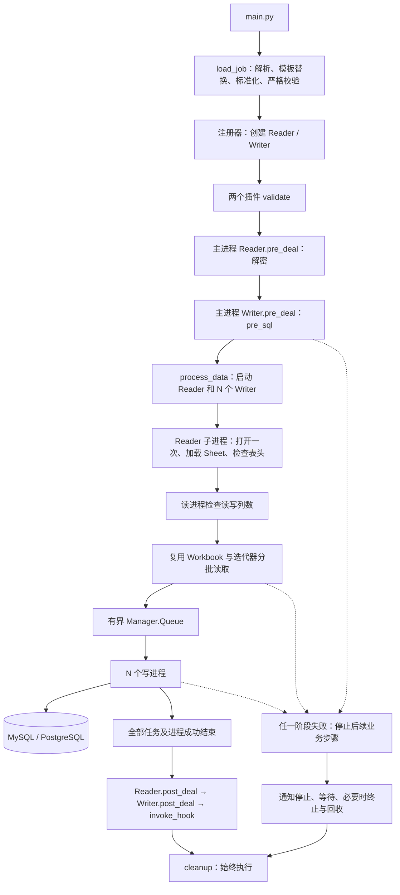

# DataXSL 多进程模型架构方案

> 更新日期：2026-09-18。本篇描述 `main.py` / `src/dataxsl` 的当前实现，包含独立的 MySQL / PostgreSQL Writer 及后续连接器边界。异步混合模型仍是独立规划，见 [异步模型架构方案](architecture-async.md)。

## 1. 定位与运行模型

DataXSL 是离线数据转换工具。简单多进程模型固定为**一条流水线：1 个读进程 + N 个写进程**，不按 channel 分片。目前可用插件是 ExcelReader、MySQLWriter 和 PostgreSQLWriter。

| 配置 | 当前语义 |
| --- | --- |
| `parallel=N` | N 个写进程，另有 1 个读进程；默认 1 |
| `queue_size=Q` | 进程间队列最多容纳 Q 个批次；默认 10 |
| `channel` | 只支持 1；大于 1 时拒绝，并提示使用异步模型 |
| Reader `chunk_size` | 每批输出行数，默认 1000 |
| `job.content` | 必须恰好有一组 Reader / Writer，不再静默忽略后续项 |

`parallel`、`queue_size`、`chunk_size` 必须为正整数，不接受布尔值。缺省 setting 使用默认值；为兼容旧配置，setting 的三个运行参数显式为 null 时也使用默认值。

当前通过 `multiprocessing` 的 spawn 上下文显式管理工作进程。除 1+N 个工作进程外，有一个主进程及一个 Manager 服务进程。显式 Process 管理用于在故障时终止并回收已运行的任务，避免依赖旧版 ProcessPoolExecutor 无法取消运行中任务的行为。

## 2. 模块与插件

| 文件 / 模块 | 职责 |
| --- | --- |
| `main.py` | CLI、日志初始化、版本输出、作业结果及退出码 |
| `src/dataxsl/config.py` | 无副作用配置读取、变量替换、旧格式兼容、JSON Schema 校验 |
| `src/dataxsl/core.py` | Context 构建插件；DataProcessor 编排生命周期、监督并回收进程 |
| `src/dataxsl/runtime.py` | spawn 工作进程入口、可取消队列、插件返回值与结束协议 |
| `src/dataxsl/reader.py`、`writer.py` | 插件抽象接口、资源清理和字段检查接口 |
| `src/dataxsl/register.py` | 插件名称到类的注册与查找 |
| `src/dataxsl/excel/excel_reader.py` | Excel 解密、表头检查、分批、选列、空值处理与连续 IDX |
| `src/dataxsl/mysql/mysql_writer.py` | 独立实现 MySQL 参数校验、字段处理、连接、批次提交、计时和异常清理 |
| `src/dataxsl/postgresql/postgresql_writer.py` | 独立实现 PostgreSQL 参数校验、字段处理、连接、批次提交、计时和异常清理 |
| `src/dataxsl/transform.py` | 目标字段类型转换，坏值报错而不是静默变成空值 |
| `src/dataxsl/utils.py` | ENC 凭据解析、外置密钥及历史密钥兼容、错误消息脱敏 |
| `src/dataxsl/logging_config.py` | 主进程日志配置和工作进程日志转发 |
| `examples/excel-to-mysql.json` | 不含业务凭据的按列顺序写入示例 |
| `examples/excel-to-postgresql.json` | PostgreSQL 连接、schema 表名、会话超时及按位置写入示例 |
| `tests/unit/`、`tests/worker_scenario.py` | 配置、Excel、模拟 SQL、CLI 及真实多进程故障测试 |

包导入只注册已实现的 `excel_reader`、`mysql_writer`、`postgresql_writer`，不初始化文件日志。MySQLReader、PostgreSQLReader、OracleReader 和其他 Writer 仍是占位实现，不能通过 Job 使用。

本次核对时源码已无 `src/dataxsl/txt`。此前文档中的 TextReader/压缩文本缺陷属于历史实现，未在此次修复中恢复或扩展该插件。

### 2.1 独立连接器与 Writer 接口

MySQLWriter 与 PostgreSQLWriter 分别直接继承 Writer。每种连接器拥有独立实现，参数 Schema、连接方式、批次处理和提交策略均放在对应插件中。

| 层次 | 当前职责 |
| --- | --- |
| `Writer` | 定义 validate、pre_deal、write_parallel、post_deal、validate_columns 和 cleanup 接口 |
| `MySQLWriter` | 独立完成 Schema 校验、参数标准化、字段转换、PyMySQL 连接和事务、队列消费及计时 |
| `PostgreSQLWriter` | 独立完成 Schema 校验、参数标准化、字段转换、Psycopg 连接和事务、队列消费及计时 |
| `config.py / transform.py / utils.py` | 提供 Schema 校验、值转换和凭据处理等工具函数，插件按需调用 |
| `DataProcessor / runtime.py` | 编排生命周期、管理进程与队列、监督失败和汇总结果 |

当前两种数据库 Writer 的参数校验不建立连接。预处理、写入和后处理的连接都由执行该操作的进程创建，在对应调用结束时关闭；插件对象仅保存可序列化配置、SQL 和统计，不把活动连接传入子进程。虽然两者目前都采用按位置取值和逐批提交，其实现分别维护。

后续 Iceberg、Hadoop、Greenplum 等连接器直接实现对应 Reader / Writer 接口，自行定义配置、资源打开与关闭、批次写入及成功确认方式。Writer 接口不要求连接器具备 db_config、SQL、游标、commit 或 rollback；本篇第 6 节的 SQL 及事务规则仅描述当前 MySQL / PostgreSQL 实现。新增连接器应在自身文档中明确提交边界和失败后可能保留的结果，这些连接器当前尚未实现。

## 3. 执行流程与生命周期



`DataXslContext.load(args)` 只加载和标准化配置，不连接数据库；`parse(args)` 在加载后构建并执行作业。Context 每次 load 覆盖前次运行配置，不沿用旧插件名称。

DataProcessor 顺序保持为：

```python
reader.validate()
writer.validate()
pre_deal()       # 主进程依次执行 Reader.pre_deal → Writer.pre_deal
process_data()   # 启动读写进程；Reader 打开、检查并连续读取
post_deal()
invoke_hook()
```

主进程严格保留 pre_deal → process_data → post_deal → invoke_hook 顺序。pre_deal 内先调用 Reader.pre_deal（解密），再调用 Writer.pre_deal（pre_sql）。成功后 process_data 启动 1 个 Reader 与 N 个 Writer。Reader 的 prepare_read 在读进程内打开 Workbook、加载 Sheet、检查表头并保留迭代器；这些对象始终留在该进程，不经过 spawn 序列化。Reader 调用只做校验、不访问数据库的 Writer.validate_columns 检查输出列数，然后直接连续读取；Writer 同时等待队列，并在每个批次写入前检查列数。没有 READY 消息或等待放行 Event。任一步失败即向上传播异常，不执行后续业务步骤。

Reader 子进程在 finally 中执行 cleanup；主进程也清理自身插件对象。Reader/Writer 的 post_deal 仍由主进程调用，不依赖子进程中产生的连接或文件对象。清理失败不能将成功作业继续报告为成功，也不覆盖已经发生的首个业务异常。Excel 解密在主进程的 Reader.pre_deal 中执行，临时路径保存在主进程 Reader 对象中。主进程无论预处理失败还是子进程被强制终止，都会在 cleanup 中删除该临时文件；子进程正常退出也执行幂等清理。读进程初始化时还可使用主进程拥有的作业临时目录，回收进程后由主进程兜底删除。

配置、输入路径和解密在 pre_sql 之前执行。Sheet、表头、选列范围及实际读写列数检查在 process_data 的 Reader 初始化期间执行，发生在 pre_sql 之后；即使空输入也检查已知列信息。若这些检查失败，作业停止，但此前已提交的 pre_sql 不会撤销。逐行类型和数据错误也可能在读取过程中出现。

## 4. 进程、队列与结果协议

### 4.1 工作进程接口

- Reader.pre_deal 在主进程执行，只做解密等预处理，不重复调用 validate；不能持有需要传给 spawn 子进程的 Workbook 或数据库连接。配置和路径校验统一由 DataProcessor.start 调用一次，耗时记入 phase_timings.validate_seconds。
- Reader.prepare_read 在读进程内打开并检查源数据，output_columns 提供列信息；可通过 configure_runtime(directory) 使用本次作业临时目录。
- Reader 实现 `read_parallel(queue)`，复用初始化后的资源，只发送 DataFrame 批次，不自行发送结束标记。
- Writer 实现 `write_parallel(queue)`，收到 `None` 才正常结束；当前接口没有 `writer_parallel()` 别名。
- 插件正常返回 `(0, None)`；失败应抛异常，也兼容 `(非零整数, 异常)`。
- 工作进程入口严格检查返回值；Writer 未消费完成标记就声称成功时，按失败处理。
- Reader 成功后，由工作进程入口按实际 N 个 Writer 发送 N 个结束标记。

### 4.2 可取消队列与失败监督

队列保持阻塞式背压，通过短超时反复检查停止事件：空队列上的读取、满队列上的写入均可响应作业取消。停止事件独立于数据队列，故障退出不依赖向满队列追加 END。

每个工作进程通过独立 Pipe 向主进程报告最终成功或失败结果（kind=result），不通过数据队列发送状态。主进程同时等待各结果、检查退出码和无结果退出，不再顺序等待 Reader 然后才检查 Writer。

首次故障后设置停止事件，等待工作进程合作退出；超出清理期限时 terminate，必要时 kill，并 join 回收。`shutdown_timeout` 是 DataProcessor 的内部/编程接口参数，默认 5 秒，不是整个作业的执行期限。数据库超时按驱动配置：MySQL 有连接/读写超时，PostgreSQL 有连接超时，SQL 执行超时需通过 session/options 或服务端设置。

如果操作被强制终止或数据库提交结果无法确认，作业返回失败；不能推断已回滚，也不自动重试。

### 4.3 结果与退出码

成功结果保存在 `context.result`，包含 status、读写进程数、读取行数、已确认提交行数和耗时。只有完成全部业务步骤及清理后 CLI 才返回成功。

#### 性能计时

每个进程结束时，主进程仅输出一条 `Process timing`，包含进程名、PID、状态和总耗时；作业结束仅输出一条 `Job timing`，包含状态和总耗时。正常结束使用 INFO，失败使用 ERROR。不打印阶段明细、行数、批次数或完整结果字典。告警及异常信息保留。

详细指标仍保存在 context.result 中，供编程调用或分析使用，不再自动输出到日志。下面的字段说明针对结果对象。

| 字段 | 含义 |
| --- | --- |
| `total` / `elapsed_seconds` | 工作进程初始化至清理完成的墙钟耗时；Reader 包括初始化和发送结束标记，不包括 spawn 启动、模块导入及日志初始化 |
| `queue` / `queue_seconds` | Reader 的 put 或 Writer 的 get 调用累计耗时，包含重试、结束标记、序列化及进程间传输，并非纯等待时间 |
| `active` / `active_seconds` | total 减去 queue，包含初始化、文件/数据库 I/O、转换与连接等耗时，不等于 CPU 耗时 |
| `init` / `initialization_seconds` | Reader 初始化及列信息获取；Writer 为 0 |
| `processing` / `processing_seconds` | 插件 read_parallel/write_parallel 调用耗时，含数据队列操作；不含 Reader 初始化、引擎发送 END 和最终 cleanup |
| `cpu` / `cpu_seconds` | 工作进程消耗的 CPU 时间，不含 Manager 进程的 CPU 时间 |
| `stages.connection_seconds` | 数据库连接、创建游标及 session SQL 的累计耗时 |
| `stages.transform_seconds` | 批次列数检查、常量字段处理、类型转换与参数组装的累计耗时 |
| `stages.execute_seconds` | executemany 调用累计耗时，包含驱动编码、网络与数据库执行 |
| `stages.commit_seconds` | commit 调用累计耗时；写入行数仅统计已确认提交的批次 |

成功结果的 `worker_timings` 保存每个进程的明细，`phase_timings` 保存主进程阶段耗时；所有单位均为秒，使用单调时钟。`Job timing` 日志和 `elapsed_seconds` 包含验证、预处理、流水线、后处理、回调和清理，不含 CLI 配置加载。`pipeline_seconds` 包含 Manager/进程启动、Reader 初始化、数据传输和回收；不包含 Writer pre_sql。`reader_pre_seconds`、`writer_pre_seconds` 是 pre_seconds 的子项；`reader_init_seconds` 是 pipeline_seconds 的子项，均不重复相加。各进程并行工作，其耗时也不能相加当作作业总耗时。

方案 1 移除了 reader_ready_wait_seconds、start_wait_seconds 和 transfer_seconds。对比方案时优先比较 Job elapsed_seconds，Reader 正式读取看 processing_seconds。Writer 队列耗时现在包含等待 Reader 首次加载 Sheet 的时间，不能将这部分解释为数据库变慢。首次 Sheet 加载仍然必要，其耗时不会因为消除第二次加载而自动下降。


定位时先比较 reader_pre（解密）、reader_init（打开文件、Sheet 和表头检查）、pipeline 和 writer_pre（预处理 SQL）。再看各进程明细：读端 queue 高可能是写端背压或传输开销；写端 queue 高可能是读端供给不足或传输开销。写入 stages 可进一步区分转换、SQL 执行和提交开销。需使用同一数据、批大小和并发参数做前后对比，不能仅凭一次计时判断回退原因。

异常返回时也上报已累计的耗时；进程崩溃或被强制终止时可能没有最终报告，不虚构这部分数据。作业失败时不保留成功结果，已输出的进程总耗时和异常日志可用于排查。

#### Excel 分项计时

主进程 Reader.pre_deal 的计时保存在结果 reader_pre_timings；读进程 prepare_read 的计时保存在 reader_init_timings。正式读取明细在 worker_timings 的 stages 中。三个阶段分开统计，初始化只做一次；不再单独打印 Excel pre/init timing 日志。

| 字段（秒） | 主进程 pre_deal | 读进程 prepare_read | 正式读取 |
| --- | --- | --- | --- |
| `decrypt_seconds` | 密码解析、文件解密和临时文件写入；未加密时为 0 | — | — |
| `open_seconds` | — | 打开工作簿一次 | 复用已打开工作簿 |
| `sheet_seconds` | — | 获取目标 Sheet 一次 | 复用已加载 Sheet |
| `header_seconds` | — | 初始化行迭代器、读取到表头、选列检查 | 从表头之后继续迭代 |
| `rows_seconds` | — | — | 行迭代、跳行、转换、选列、空行过滤、IDX 和批次列表构造 |
| `dataframe_seconds` | — | — | 批次列表构造成 DataFrame 的累计耗时 |
| `enqueue_seconds` | — | — | 数据批次 put 的累计耗时，不含引擎发送 END |
| `close_seconds` | — | 仅初始化失败时关闭工作簿；成功为 0 | 读取结束或异常时关闭工作簿 |

按 API 调用边界计时：如果解析器在获取 Sheet 或首次迭代时才加载数据，开销会落在 sheet/header 中，不能将 header 理解为仅解析表头几格。`rows_seconds` 以批次为单位计时，包含底层行读取和 Python 转换，不逐单元格或逐行调用时钟、不打印批次数据。

`reader_pre_timings` 和 `reader_init_timings` 分别细分 reader_pre_seconds、reader_init_seconds，不重复相加；Reader stages.enqueue 与进程 queue 耗时范围重叠，也不能相加。open/sheet/header 仅在初始化明细中出现，正式读取不再重复加载；decrypt 高时关注文件解密，rows 高时关注行读取转换，dataframe 高时关注批次构造。异常时保留插件中已经累计的分项，日志只报告总耗时和异常。

| 情况 | CLI 退出码 |
| --- | --- |
| 全部成功 | 0 |
| 配置、读写、后处理或清理失败 | 1 |
| argparse 参数错误 | 2 |
| 用户中断 | 130 |

`invoke_hook()` 当前仍为空扩展点。失败结果通过异常和非零退出码传递，尚未持久化为作业历史。

## 5. Excel 数据处理

- `header` 为零基表头索引，表头及之前的行不输出。
- `skip_rows` 为单个整数或整数列表，表示零基行索引，不表示跳过前 N 行。
- `use_cols` 是位置索引；开启 `ins_row_num` 后先在最前面加入 IDX，再按位置选列。
- 空业务行在批次构造前过滤；IDX 不参与空行判断，完整批次与尾批次采用相同逻辑。
- IDX 定义为**本次读取中实际输出记录的连续一基序号**，跨批次连续，不是原始工作表行号。
- 空字符串、NaN 转为 None，可整除浮点数转为整数；DataFrame 使用 object dtype 保留空值与 Python 标量。
- 主进程解密到独享临时文件并保存其路径，Reader.cleanup 在正常结束、失败和子进程强制终止后清理；不会覆盖原目录中同名 `_decrypted` 文件。
- `encode` 保留为历史兼容参数，Excel 引擎不使用它。

未执行源文件内容的全部预扫描，不能保证所有脏数据都在 pre_sql 前发现。Calamine/工作簿缓冲不受 batch 队列容量严格限制。

## 6. MySQL / PostgreSQL 按列顺序写入、类型与事务

### 6.1 读写字段按位置对应

参考 DataX 的配置方式，Reader 输出列顺序与 Writer 写入列顺序一致：第 1 个值写入 `writer.column` 的第 1 个字段，依此类推。源列名和目标列名可以不同，不按名称匹配或重新排序，不提供 `source_columns` 配置。

`additive_attr` 保留原有行为：同名源列原位赋值；新增常量列按配置顺序追加到末尾，目标 `column` 必须按最终输出顺序排列。输入数据批次不会被原地修改。

```json
{
  "column": ["account", "amount", "biz_date"],
  "additive_attr": {"biz_date": "${biz_date}"},
  "column_types": {
    "account": "string",
    "amount": "decimal",
    "biz_date": {"type": "date", "format": "%Y-%m-%d"}
  }
}
```

这只是 writer 参数片段。Reader 依次输出账户、金额两列，追加业务日期后，依次写入 account、amount、biz_date。

在 process_data 的 Reader 初始化阶段检查最终输出列数与目标列数，每批写入也检查列数；此时 pre_sql 已执行。按位置写入是正常行为，不再产生旧模式告警。字段含义和顺序由作业配置保证；数量相同但语义顺序错误无法自动识别。常量字段遇到多个同名源列时明确失败。

旧 `reader.column` 非空、空列表或缺省都可读取；该字段仅作为历史元数据移除并提醒，不突然启用过去未执行的类型转换。旧 `reader.parallel` 不参与运行并发，setting.parallel 是唯一来源。

### 6.2 类型转换与 SQL 能力

`column_types` 可按目标字段指定 string、int/integer、float/double、decimal、boolean、date、datetime/timestamp、time。支持类型字符串或带 type/format 的对象；日期格式支持 Python strptime 格式及原有 yyyy-MM-dd 风格。

显式数值转换拒绝非法值、非有限值和小数转整数；失败报告批次行位置和目标字段，不输出原值，也不静默改为空。未配置类型的字段保持原值，仅统一空值。

只支持 `writerMode=insert`，其他模式明确拒绝；`session` 支持 SQL 字符串或列表，在每个连接上执行。MySQL 目标标识符使用反引号转义，PostgreSQL 使用双引号，数据值均使用 `%s` 占位符。

MySQL 连接默认 `connect_timeout=10`、`read_timeout=30`、`write_timeout=30`，可在 db_config 显式设置正数。两种 Writer 为维持批次事务均拒绝 autocommit=true。

### 6.3 事务及资源边界

- pre_sql 使用独立连接，全部执行成功后提交。
- 每个写进程独立连接，每批 executemany 成功后提交，再增加 rows_written。
- post_sql 仅在全部读写成功后执行，使用另一个连接。
- 连接、session SQL、前后 SQL、批量写入和提交失败都会传播；能回滚时先回滚，再关闭游标及连接。
- 连接建立失败不访问未赋值连接；回滚或清理发生次生异常时不覆盖首个业务错误。

**顺序执行不等于整个作业同一事务。** 已提交的 pre_sql 和批次不会因后续失败自动撤销。当前未实现暂存表发布、全作业回滚、幂等重试或断点续传；需要完整替换和自动重跑的业务必须另行选择方案。

### 6.4 PostgreSQL Writer

`postgresql_writer` 直接实现 Writer 接口，使用 Psycopg 3 同步连接，独立实现按位置取值、附加字段、类型转换、队列消费、逐批 executemany/commit 和计时。其配置与行为参照 MySQLWriter，两者分别维护。每个写进程在自身启动后建立并复用一个连接，插件对象不保存连接或游标，因此可被 spawn 序列化。主进程前后 SQL 各用独立连接，执行顺序不变。

| 配置 / 能力 | MySQL Writer | PostgreSQL Writer |
| --- | --- | --- |
| 插件名 | `mysql_writer` | `postgresql_writer` |
| 驱动 | PyMySQL | Psycopg 3，依赖 `psycopg[binary]>=3.1,<4` |
| 数据库名 | `database` 或驱动兼容参数 `db` | `database` 标准化为 `dbname`，二者不可同时配置 |
| schema | 不单独配置 | `db_config.schema` 可选；用于未限定的目标表及连接初始 search_path |
| 表名引用 | 分段加反引号 | `表名` 或 `schema.表名`，分段加双引号 |
| 连接超时 | 默认 10 秒，正数 | 默认 10 秒，正整数 |
| 读写 / SQL 超时 | read_timeout、write_timeout 默认各 30 秒 | 不接受 MySQL 读写超时参数；statement_timeout 按 session/options 或服务端配置 |
| 写入与提交 | INSERT、每批提交 | INSERT、每批提交 |

- `table` 支持 `表名` 或 `schema.表名`。每个部分用 Psycopg Identifier 引用；大小写原样保留，不自动转小写。字段名也逐个引用，不需要配置 SQL 引号。
- `db_config` 支持 host、hostaddr、port、user、password、database/dbname、schema、connect_timeout、application_name、options、client_encoding、SSL 及 keepalive 参数；完整白名单见 POSTGRESQL_WRITER_SCHEMA。拒绝未知参数，避免误用 MySQL 的 charset/read_timeout/write_timeout。
- `schema` 为可选的非空字符串，拒绝空白名称、NUL 和非字符串值。它是连接器参数，建立连接时不会传给 psycopg.connect；保留在插件配置中供 spawn 子进程使用。schema 视为单个名称，不拆成 search_path 列表，也不自动创建 schema。
- 当 table 为单段名称时，INSERT 显式引用 db_config.schema；table 已写成 schema.table 时，其自身限定优先。每个预处理、写入及后处理连接在 session 前执行安全引用的 `SET search_path TO ...`，让未限定的业务 SQL 使用该 schema。未配置 schema 时不修改原有 search_path。
- 显式配置的 schema 初始化覆盖连接 options 中的初始 search_path；随后用户 session SQL 可以再次修改 search_path。该修改不影响已经显式限定 schema 的 INSERT。session、pre_sql、post_sql 原样执行，不自动改写 SQL 内的名称或大小写；手写 SQL 必须遵循目标对象的实际大小写。schema 设置失败按连接初始化失败处理，回滚并关闭资源后传播异常。
- `database` 是与 MySQL 作业一致的配置别名，校验后转成 Psycopg 的 `dbname`；二者同时出现会报错。password 支持既有 ENC 解密机制。
- `connect_timeout` 默认 10 秒，只接受正整数。SQL 执行超时可用 `session: ["SET statement_timeout = '30s'"]` 设置；这不是网络读写超时。未配置时使用 PostgreSQL 服务端默认值。
- 每批执行成功并提交后才增加 rows_written；失败回滚当前事务并传播异常，执行器终止其他工作进程，不执行 post_sql/hook。已提交批次仍然保留。
- 本阶段仅实现 INSERT 写入；没有 COPY、UPSERT 或 PostgreSQL Reader，不改变 channel=1 和 parallel=N 的含义。

驱动行为参考 [Psycopg executemany/pipeline](https://www.psycopg.org/psycopg3/docs/advanced/pipeline.html)、[PostgreSQL 连接参数](https://www.postgresql.org/docs/17/libpq-connect.html)、[search_path](https://www.postgresql.org/docs/16/runtime-config-client.html#GUC-SEARCH-PATH) 和 [标识符大小写规则](https://www.postgresql.org/docs/17/sql-syntax-lexical.html#SQL-SYNTAX-IDENTIFIERS)。驱动内部的批量发送机制不改变本工具显式的逐批提交边界。

## 7. 配置、运行和示例

### 插件参数校验

主进程在执行任何 pre_deal 之前，分别调用一次 Reader.validate 和 Writer.validate。Job 结构由 config.py 的 JOB_SCHEMA 校验；插件参数由插件自身的 EXCEL_READER_SCHEMA、MYSQL_WRITER_SCHEMA、POSTGRESQL_WRITER_SCHEMA 校验，复用 config.py 的 validate_schema。校验器基于 JSON Schema Draft 7，统一报告字段路径与违反的规则，不输出配置原值、密码或 SQL 内容。

- Excel Schema：路径和 Sheet 名称、密码类型、批大小、表头索引、跳过行、选列索引及去重、IDX 开关。历史 parallel 和 encode 仍为兼容参数，不影响读取行为。
- MySQL Schema：目标表和列名、重复目标列、insert 模式、session/pre_sql/post_sql 结构、常量值、column_types 类型定义、连接参数名称、端口和超时范围。其他受支持的驱动参数保留透传；驱动特有语义由 PyMySQL 检查。
- PostgreSQL Schema：在自身插件中定义目标列、写入模式、SQL 和附加字段规则，按需引用通用类型定义；校验一段或两段表名、连接参数白名单、database/dbname 互斥、可选 schema 名称、整数端口与连接超时、SSL 模式及 keepalive 参数。允许 autocommit 缺省、false 或 null，校验后统一设为 false。
- 为保持已有语义，整数参数仅接受 Python int，不接受布尔值或 1.0；数值参数拒绝 NaN/Infinity。默认值仍由构造函数及标准化代码填充，Schema 的 default 不用于自动赋值。SQL 字符串在校验通过后统一转换成列表。
- 文件存在检查、ENC 解密、column_types 是否引用目标字段仍使用 Python 检查。Sheet、表头及实际读写列数检查仍在 process_data 的 Reader 初始化阶段执行，不提前打开文件，也不恢复字段映射。
- pre_deal 不重复校验。自行通过 Python API 使用插件时，须先 validate，再执行预处理或读写。

完整无业务凭据示例见 [examples/excel-to-mysql.json](../examples/excel-to-mysql.json)，输入 Sheet1 包含“账户”“金额”两列表头，目标表需事先建立 account、amount、biz_date 字段。

PostgreSQL 示例见 [examples/excel-to-postgresql.json](../examples/excel-to-postgresql.json)，Reader 配置及字段顺序相同，使用 table="etl_demo" 和 db_config.schema="public"，目标表为 public.etl_demo。setup.py 包含 dataxsl.postgresql 及 psycopg[binary] 运行依赖。

从项目根目录安装和运行：

```bash
python -m pip install -e .
# 先在运行环境提供 DB_HOST、DB_USER、DB_PASSWORD、DB_NAME。
python main.py -job examples/excel-to-mysql.json \
  -p input_path=/path/to/input.xlsx -p biz_date=2026-09-17
# PostgreSQL 使用对应数据库的环境变量和预先创建的 public.etl_demo 表。
python main.py -job examples/excel-to-postgresql.json \
  -p input_path=/path/to/input.xlsx -p biz_date=2026-09-18
```

- 源码入口显式使用同目录 src，避免误用旧安装包；也支持 `--job` 和 `--param`。
- 先解析 JSON，再递归替换字符串值中的 `$name` / `${name}`，不会因替换值中的引号或反斜杠破坏 JSON。
- 变量来自环境和 CLI，CLI 优先；`key=value` 仅切分第一个等号，缺失变量立即报错，不记录参数值。
- 模板变量必须放在合法 JSON 字符串中；字面量美元符号写为 `$$`。端口等原生数值参数直接写 JSON 数值，不自动把 CLI 字符串猜成数值。
- 旧 `setting.speed` 结构在加载层兼容；与扁平 setting 同名参数值冲突时明确失败。
- 校验覆盖 Job 结构、单 content、插件参数、读写列数和数值范围；不再记录校验失败后继续导入。
- 兼容 Reader 顶层的可选 `mode: "readOnly"` 声明；它不传入 Reader 构造参数。其他 mode 值和未知字段仍会被拒绝，Writer 不接受该字段。
- 运行环境要求 Python 3.12+，setup.py 通过 python_requires='>=3.12' 声明最低版本；pyproject.toml 声明构建后端，包列表包含 dataxsl.postgresql。当前回归验证环境为 Python 3.12.7。

旧业务样例仍可能包含本机路径、空文件和历史字段，仅作为参考。本次没有修改业务凭据或执行业务样例 SQL。

## 8. 日志、凭据与临时资源

主进程显式初始化日志，按 APP_ENV 选择 config/logging-<env>.yaml，找不到时使用 logging.yaml，无配置时回退控制台。当前开发配置的 root、console 和普通文件处理器均为 DEBUG，错误文件处理器为 ERROR；日志格式包含进程名称和 PID。各环境实际输出级别以对应 YAML 为准。

工作进程通过 QueueHandler 发送日志，主进程 QueueListener 写文件，避免各进程独立轮转同一日志文件。包导入不创建日志目录或打开文件。

DEBUG 日志仅允许 logger 名称为 dataxsl 或以 dataxsl. 开头的记录；msoffcrypto、psycopg 等第三方库的 DEBUG 会被过滤。INFO 及以上记录仍按环境配置的日志级别输出。LoggingManager 在主进程的控制台、文件及已配置的独立 handler 上统一挂载过滤器，工作进程在 QueueHandler 入队前过滤；回退控制台也使用同一规则。只在 root logger 上设置过滤器不能覆盖子 logger 传播及 QueueListener 转发，因此过滤逻辑放在 handler 上。

凭据可以直接通过环境模板注入。保留 `ENC(...)` 兼容：优先使用环境变量 `DATAXSL_ENCRYPTION_KEY`，支持 16/24/32 字节 UTF-8 字符串或 `hex:` 前缀的十六进制密钥；缺省时为兼容现有密文仍使用旧密钥并告警。

旧密钥仍存在意味着历史 ENC 不能视为安全的密钥管理方案，迁移应重新加密并提供外置密钥。CLI 不打印参数字典，参数校验错误不附带原始值，已知凭据从入口与工作进程错误消息中脱敏。临时解密文件路径由主进程记录，正常及子进程强制终止后均由 Reader.cleanup 清理。

## 9. 测试与验收

使用标准库 unittest，无需连接业务数据库：

```bash
PYTHONPATH=src python -B -m unittest discover -s tests/unit -t . -v
```

2026-09-18 验证记录：Python 3.12.7 环境下 76 项测试全部通过，包括真实 spawn 子进程场景；MySQLWriter、PostgreSQLWriter、core.py 和 runtime.py 通过静态类型检查。安装包包含独立 PostgreSQL 插件及 Psycopg 依赖，Python 最低版本元数据为 >=3.12；PostgreSQL JSON 示例通过配置校验。数据库操作使用模拟连接，未开展真实 PostgreSQL 导入或吞吐测试。

测试覆盖：

- 严格 schema、默认值、channel 限制、旧 setting.speed、模板引号/反斜杠/等号和缺失变量。
- parallel=1/4、队列容量为 1 时的真实 spawn 多进程搬运：批次无重复无遗漏、空数据正常结束、计数正确。
- 读取异常、写入异常、非零返回、进程崩溃、不响应停止的任务、Writer 提前返回及用户中断；失败后不执行 post_deal，进程得到回收。
- 实际生成的最小 xlsx 文件：分批、尾批次、空业务行、连续 IDX、选列与跳行；解密失败清理。
- 模拟数据库：前后 SQL、session、按列顺序写入、常量列、类型转换、提交计数、回滚与关闭顺序，以及列数错误阻止批次写入。
- CLI 帮助、失败退出码、错误信息不回显秘密、外置 ENC 密钥、日志配置和公开样例；主进程控制台/文件/独立 handler、工作进程入队前及 QueueListener 转发时的 DEBUG 包范围过滤。

测试采用临时输入文件和模拟 MySQL/PostgreSQL 连接。PostgreSQL 覆盖插件注册及 spawn 序列化、配置校验、字段位置与类型、标识符转义、逐批提交及失败回滚，以及 schema 校验、目标表限定、各阶段 search_path 初始化、1/4 个写进程搬运和失败后停止后处理；实际数据库驱动兼容、目标表约束和吞吐需要在业务测试库继续验证。某些沙箱禁止 Manager 的本地 IPC 套接字，此时多进程测试需在允许本地 IPC 的环境执行。

## 10. 修复范围与保留限制

当前已实现单流水线的故障退出、Excel 清理和数据处理、MySQL/PostgreSQL 按列顺序写入和事务异常传播，以及 CLI、依赖与日志管理。MySQLWriter 和 PostgreSQLWriter 均为直接实现 Writer 接口的独立连接器；PostgreSQL 本阶段仅增加写入，没有改动异步运行代码。

保留的边界：

1. 全作业原子发布、幂等重试和断点续传尚未实现，前后 SQL 与批次提交仍独立。
2. 读写字段按位置对应，作业配置需保证字段顺序一致；不自动检测同列数的语义错位。
3. 历史 ENC 密钥仍有兼容回退，不能替代独立凭据管理。
4. TextReader、数据库 Reader、OracleWriter 等不在当前可用插件中，不恢复已移除实现或扩展占位能力。
5. 不实现多 channel 分片，也不在简单模型中引入协程队列。
6. 故障/取消提供有期限的退出路径；没有为所有正常作业设置全局运行时限，数据库 I/O 依靠连接参数的超时。

2026-09-15 至 2026-09-17 的初始分析中记录的“parallel 未传递”“write_parallel 接口不一致”“按顺序等待导致挂起”等缺陷已由本篇当前行为替代；queue_size 的已有修复保留并加入验证。
